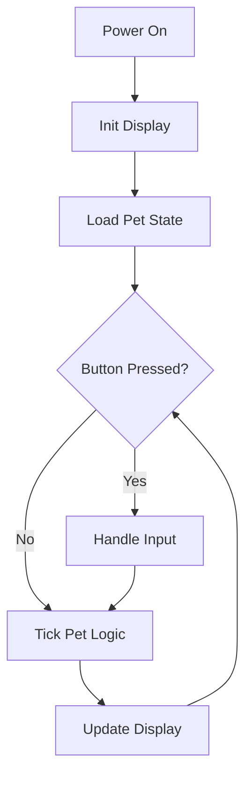

# Content Guide

How to add and update content on the Dilder website. All content is plain Markdown. No build tools or special knowledge required to write a post.

---

## Table of Contents

1. [Site Structure Overview](#1-site-structure-overview)
2. [The Golden Rule](#2-the-golden-rule)
3. [Writing a Blog Post](#3-writing-a-blog-post)
4. [Adding or Updating a Docs Page](#4-adding-or-updating-a-docs-page)
5. [Updating the Landing Page](#5-updating-the-landing-page)
6. [Adding Pages to Navigation](#6-adding-pages-to-navigation)
7. [Front Matter Reference](#7-front-matter-reference)
8. [MkDocs Material Markdown Features](#8-mkdocs-material-markdown-features)
9. [Adding Images and Media](#9-adding-images-and-media)
10. [Previewing Locally Before Publishing](#10-previewing-locally-before-publishing)
11. [Publishing — Pushing to GitHub](#11-publishing--pushing-to-github)

---

## 1. Site Structure Overview

```
website/
├── mkdocs.yml           ← Site config: nav, theme, plugins
└── docs/                ← All content lives here
    ├── index.md         ← Landing page (/)
    ├── about/
    │   ├── index.md     ← About page (/about/)
    │   └── contact.md   ← Contact (/about/contact/)
    ├── blog/
    │   ├── index.md     ← Blog landing (/blog/)
    │   └── posts/       ← DROP NEW POSTS HERE
    │       ├── phase-0-planning.md
    │       └── phase-1-hardware-begins.md
    ├── docs/            ← Reference documentation
    │   ├── index.md     ← Docs overview (/docs/)
    │   ├── hardware/
    │   │   ├── materials-list.md
    │   │   ├── wiring-pinout.md
    │   │   └── enclosure-design.md
    │   ├── setup/
    │   │   ├── pi-zero-setup.md
    │   │   ├── display-setup.md
    │   │   └── dev-environment.md
    │   └── software/
    │       └── project-structure.md
    ├── community/
    │   ├── index.md
    │   ├── discord.md
    │   └── support.md
    ├── prompts/
    │   └── index.md     ← Updated manually from PromptProgression.md
    └── stylesheets/
        └── extra.css    ← Custom CSS tweaks
```

---

## 2. The Golden Rule

**Blog posts** = one-time, timestamped entries in `docs/blog/posts/`. They record what happened at a point in time. Never go back and edit the substance of a blog post.

**Docs pages** = evergreen reference pages. Update these whenever the actual state of the hardware, setup, or software changes. They should always reflect current reality.

If you're documenting a new milestone → write a blog post.
If you're correcting or expanding reference material → edit the docs page.

---

## 3. Writing a Blog Post

### Step 1 — Create a New File

Create a new `.md` file in `website/docs/blog/posts/`.

File naming convention: `YYYY-MM-DD-short-description.md` or `phase-N-topic.md`

Examples:
- `phase-2-firmware-scaffold.md`
- `2026-04-15-first-display-test.md`
- `2026-04-20-button-wiring-done.md`

### Step 2 — Add Front Matter

Every post must start with a YAML front matter block:

```markdown
---
date: 2026-04-15
authors:
  - rompasaurus
categories:
  - Hardware
slug: first-display-test
---
```

| Field | Required | Notes |
|-------|----------|-------|
| `date` | Yes | `YYYY-MM-DD` format |
| `authors` | No | Must match a key in `docs/blog/.authors.yml` |
| `categories` | No | Creates category index pages |
| `slug` | No | Controls URL. Defaults to the filename. Use short, lowercase, hyphenated words. |
| `tags` | No | More granular than categories. Currently unused. |

### Step 3 — Write the Post

After the front matter, write the post in standard Markdown:

```markdown
---
date: 2026-04-15
authors:
  - rompasaurus
categories:
  - Hardware
slug: first-display-test
---

# First Display Test

We have pixels.

<!-- more -->

After two hours of fighting with the SPI configuration, the Waveshare demo script finally produced output...
```

**The `<!-- more -->` marker is important.** Text before it shows as the preview on the blog index. Put a 1–2 sentence hook before it, then continue with full content after.

### Step 4 — Preview and Publish

See [Section 10](#10-previewing-locally-before-publishing) and [Section 11](#11-publishing--pushing-to-github).

### Available Categories

Use consistent categories to keep the blog organized:

| Category | Use for |
|----------|---------|
| `Planning` | Research, decisions, design |
| `Hardware` | Component assembly, wiring, physical build |
| `Software` | Firmware, code, scripts |
| `3D Printing` | Enclosure design and printing |
| `Community` | Discord, Patreon, community updates |

---

## 4. Adding or Updating a Docs Page

### Updating an Existing Page

1. Open the file in `website/docs/docs/` (or relevant subfolder)
2. Edit the Markdown
3. Save, push — done

Docs pages don't need front matter (no date or author required). Just write clean Markdown.

### Adding a New Docs Page

1. Create a new `.md` file in the appropriate subfolder:
   - Hardware reference → `docs/docs/hardware/`
   - Setup guides → `docs/docs/setup/`
   - Software → `docs/docs/software/`

2. Write the page content

3. Add it to `mkdocs.yml` navigation:

```yaml
nav:
  - Docs:
      - Hardware:
          - Materials List: docs/hardware/materials-list.md
          - Your New Page: docs/hardware/your-new-page.md  # ← add here
```

Without adding to nav, the page will still build but won't appear in the sidebar.

---

## 5. Updating the Landing Page

The landing page is `website/docs/index.md`.

### Updating the Phase Status

Find this block and update it:

```markdown
!!! info "Phase 1 — Hardware Assembly"
    We have a components list and a test bench plan...

    [See the hardware docs](docs/hardware/materials-list.md){ .md-button }
```

Change the admonition title, description, and button link to match the current phase.

### Updating the Latest Post Preview

The blog plugin automatically shows recent posts — you don't need to manually update this. Just write a new post and it will appear.

---

## 6. Adding Pages to Navigation

The `nav:` section in `mkdocs.yml` controls what appears in the sidebar.

```yaml
nav:
  - Home: index.md
  - Blog:
      - blog/index.md
  - Docs:
      - Overview: docs/index.md
      - Hardware:
          - Materials List: docs/hardware/materials-list.md
          - Wiring & Pinout: docs/hardware/wiring-pinout.md
          # Add new hardware pages here:
          - Button Wiring: docs/hardware/button-wiring.md
```

Rules:
- Indentation = nesting level in the sidebar
- `- Page Title: path/to/file.md` for a page
- `- Section Name:` with indented children for a collapsible section
- Blog posts do **not** need to be in nav — the blog plugin handles them automatically

---

## 7. Front Matter Reference

### Blog Posts

```yaml
---
date: 2026-04-15           # Required. Publication date.
authors:
  - rompasaurus            # Optional. Author key from .authors.yml
categories:
  - Hardware               # Optional. Creates category pages.
tags:
  - e-ink                  # Optional. More granular tagging.
slug: my-post-slug         # Optional. Controls URL path.
draft: true                # Optional. Hides from index until removed.
---
```

### Regular Pages

Regular docs pages don't require front matter. Optionally add:

```yaml
---
title: Custom Page Title   # Overrides the H1 heading in the browser tab
description: SEO description for this page
---
```

---

## 8. MkDocs Material Markdown Features

### Admonitions (Callout Boxes)

```markdown
!!! note "Optional custom title"
    This is a note box. Great for "this is important to know."

!!! warning
    This is a warning. Use for "don't do this" or "be careful."

!!! tip
    This is a tip. Use for shortcuts and recommendations.

!!! danger "Critical"
    Danger box. Use for "this will break things."

!!! info "Phase Status"
    Current: Phase 1
```

Renders as colored, styled boxes with icons.

Use collapsible admonitions for optional/extra info:

```markdown
??? note "Click to expand"
    This content is hidden by default.
```

### Code Blocks with Syntax Highlighting

````markdown
```python
def hello():
    print("Hello, Dilder!")
```
````

With line numbers:

````markdown
```python linenums="1"
import time
from waveshare_epd import epd2in13_V3
```
````

With highlighted lines:

````markdown
```python hl_lines="2 3"
epd = epd2in13_V3.EPD()
epd.init()        # ← highlighted
epd.Clear()       # ← highlighted
```
````

### Tabbed Content

Great for showing "do this on macOS / do this on Linux" side by side:

```markdown
=== "macOS"
    ```bash
    brew install python
    ```

=== "Linux"
    ```bash
    apt install python3
    ```

=== "Windows"
    Download from python.org
```

### Mermaid Diagrams

````markdown

````

### Tables

```markdown
| Column 1 | Column 2 | Column 3 |
|----------|----------|----------|
| Value 1  | Value 2  | Value 3  |
| Value 4  | Value 5  | Value 6  |
```

Column alignment:

```markdown
| Left | Center | Right |
|:-----|:------:|------:|
| L    |   C    |     R |
```

### Internal Links

```markdown
[Link to another page](../docs/hardware/materials-list.md)
[Link to a heading](../docs/hardware/wiring-pinout.md#button-wiring)
```

Use relative paths from the current file's location.

### Buttons (Material Extension)

```markdown
[Primary button text](url){ .md-button .md-button--primary }
[Secondary button](url){ .md-button }
```

### Cards Grid (Landing Page)

```markdown
<div class="grid cards" markdown>

-   :material-book-open-variant: **Card Title**

    ---

    Card description text here.

    [:octicons-arrow-right-24: Link text](url)

</div>
```

---

## 9. Adding Images and Media

### Images

Store images in `website/docs/assets/images/` (create this folder as needed).

```markdown


<!-- With caption -->

*This is a caption*
```

For SVG files in the `docs/concepts/` folder:

```markdown

```

Adjust the relative path (`../`) based on how deep the page is in the folder structure.

### Embedding YouTube Videos

MkDocs Material supports embedded HTML in Markdown:

```markdown
<iframe
  width="100%"
  style="aspect-ratio: 16/9"
  src="https://www.youtube.com/embed/YOUR_VIDEO_ID"
  frameborder="0"
  allowfullscreen>
</iframe>
```

Replace `YOUR_VIDEO_ID` with the ID from the YouTube URL (the part after `?v=`).

### Inline SVGs

For small diagrams, SVGs can be embedded directly:

```markdown
<figure>
  
  <figcaption>Figure 1: Button wiring diagram</figcaption>
</figure>
```

---

## 10. Previewing Locally Before Publishing

Always preview before pushing to avoid publishing broken layouts.

```bash
cd ~/dilder/website
source venv/bin/activate
mkdocs serve
```

Open [http://127.0.0.1:8000](http://127.0.0.1:8000) in your browser.

The server hot-reloads — save a file and the browser updates automatically.

**Check list before pushing:**
- [ ] Page appears in the sidebar navigation
- [ ] Blog post appears on the blog index with correct date
- [ ] No broken links (look for 404 errors in the terminal)
- [ ] Code blocks render correctly
- [ ] Mobile layout looks ok (shrink the browser window)

---

## 11. Publishing — Pushing to GitHub

Once the GitHub Actions workflow is set up (see [IMPLEMENTATION.md](IMPLEMENTATION.md#8-deployment--github-pages-free)):

```bash
git add website/
git commit -m "Add Phase 2 blog post"
git push
```

GitHub Actions automatically:
1. Detects changes in `website/`
2. Installs MkDocs Material
3. Runs `mkdocs gh-deploy`
4. Publishes the site to GitHub Pages

Check the **Actions** tab in your GitHub repo to monitor the build. Takes ~1–2 minutes.

The live site updates at `https://rompasaurus.github.io/dilder/` (or your custom domain).

### Manual Deploy (Without GitHub Actions)

If you need to deploy from your local machine:

```bash
cd ~/dilder/website
source venv/bin/activate
mkdocs gh-deploy
```

This builds the site and pushes to the `gh-pages` branch directly.
