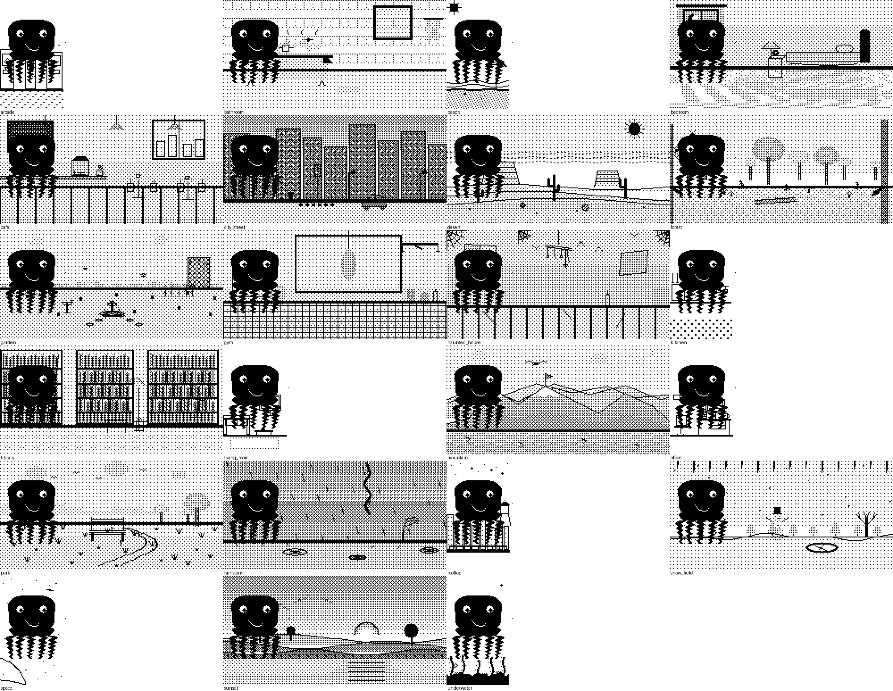
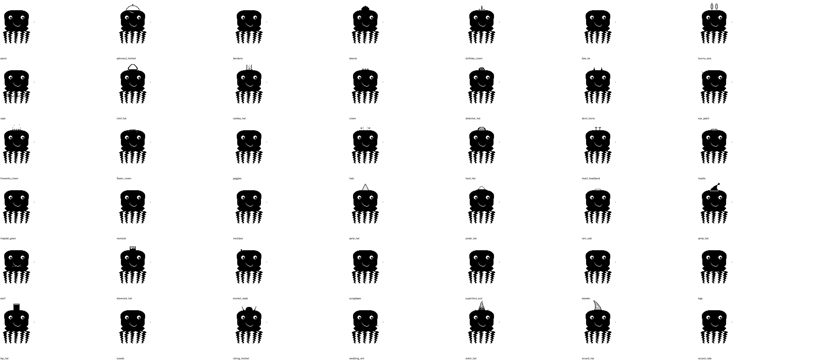
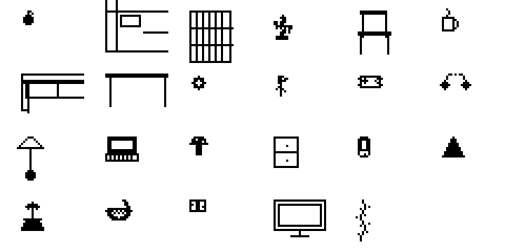
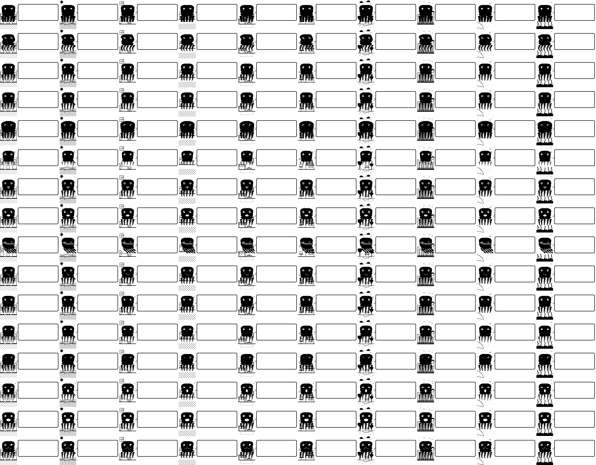
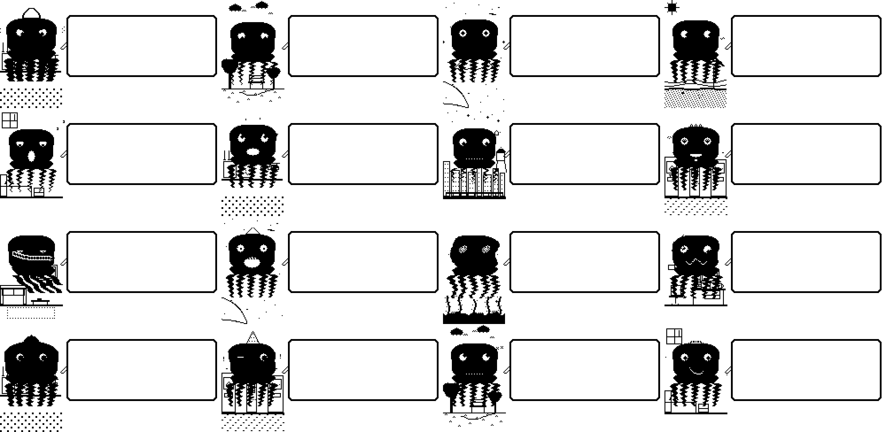
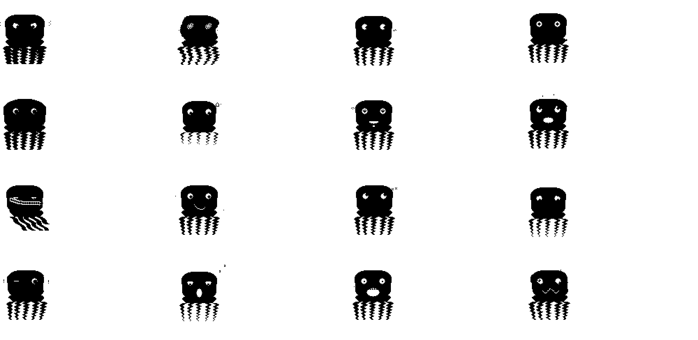

# The Asset Rendering System — 22 Environments, 42 Outfits, 29 Props

Dilder's visual world expanded massively today. A complete Python rendering pipeline now generates every combination of octopus + emotion + environment + outfit + decor prop — all at 1-bit monochrome resolution matching the 250x122 e-ink display.

<!-- more -->

## The Rendering Pipeline

Every visual in Dilder is drawn mathematically — no pre-baked sprites, no pixel art by hand. A Python module system generates all assets at 4x scale (1000x488 pixels), then they're downscaled and dithered for the e-ink display.

The pipeline is modular:

```
core/        → Canvas, body shape, drawing primitives
emotions/    → 16 face transforms (eyes, mouth, brows, lids)
environments/→ 22 background scenes
outfits/     → Headwear, bodywear, eyewear, accessories
decor/       → Furniture, food, weather effects, plants, electronics
aura/        → Particle effects per emotion
poses/       → 6 shared + 16 unique body poses
```

Running `render_all.py` generates every combination as individual PNGs plus grid compilations for review.

## The 22 Environments

Each environment is a complete background scene with unique visual elements — furniture, landscape, weather, and ambient details. All rendered in 1-bit black and white using dither patterns for depth and texture.



**Indoor scenes:** Living room, kitchen, bedroom, bathroom, office, library, arcade, gym, cafe.

**Outdoor scenes:** Park, garden, forest, beach, mountain, desert, city street, rooftop, sunset.

**Atmospheric scenes:** Rainstorm, snow field, space, underwater, haunted house.

Each environment has an idle and speaking variant — the octopus's mouth position changes between frames to create a conversation animation cycle.

## 42 Outfits

The outfit system has four equip slots: headwear, bodywear, eyewear, and accessories. Mix and match across categories for billions of possible combinations.



Headwear ranges from practical (explorer hat, chef hat) to absurd (party hat, pirate hat, space helmet). Bodywear includes scarves, capes, and aprons. Eyewear covers glasses, sunglasses, monocles, and goggles. Accessories add bow ties, necklaces, and badges.

In gameplay, outfits unlock through achievements, bond levels, step milestones, and treasure hunts. Some are exclusive to specific months — miss April's hat and it's gone forever.

## 29 Decor Props

Props fill out the scene around the octopus — furniture to sit on, food to eat, weather effects falling from above, plants growing in the background, and electronics beeping nearby.



Props are separate from the outfit system. They're placed in the scene by the rendering engine based on the current environment and equipped decorations.

## Emotion x Environment Matrix

Every emotion works in every environment. The octopus changes its facial expression and body language while the background stays consistent, creating natural scenes:



## Curated Showcase

Some combinations are just chef's-kiss. Here are hand-picked favorites:



## Aura Particles

Each emotion has a unique aura — particle effects emanating from the octopus that reinforce the mood. Angry gets sharp jagged sparks, sad gets falling tear drops, excited gets exploding star bursts, chill gets drifting waves.



## What's Next

These assets live in the `assets/octopus/` module as Python code. The next step is the `python_to_c_guide.md` — translating these renders into the C firmware's runtime drawing engine. The Pico W (and soon ESP32-S3) draws the octopus line-by-line using `Paint_DrawLine`, `Paint_DrawCircle`, and custom bezier routines. No bitmaps stored in flash — every frame is computed from math.

The environments will be selectable as equippable backgrounds through the Decor menu once Phase 3A (core game loop) is implemented. For now, they exist as rendered proof-of-concept showing what the e-ink display will look like when the full game is running.
