# Dilder Full Board Rev 1 — One Green Rectangle to Rule Them All

After two months of breadboards, flying wires, hot-glued battery clips, and a stack of off-the-shelf modules taped to the inside of a 3D-printed case, the Dilder is finally a **single board**. One PCB. One green rectangle the size of a chocolate bar. Everything the octopus needs to live, lives on it.

This is a huge milestone, so this post is the friendly tour — what got built, what got learned, and why the silkscreen says "The Dildafication Begins" on the front.

<!-- more -->

## What's actually on the board

Imagine the Dilder up to this point as a clattering bag of parts: a tiny Pico computer, a charger module, a battery, a little gyro sensor, a 5-way joystick switch, a piezo speaker, a slide switch, a USB-C port, an e-paper screen — all wired together with rainbow jumpers. Rev 1 of the **Dilder Full Board** is the moment all of those parts get a permanent home next to each other, with the wires baked into the copper of the board itself.

<figure markdown="span">
  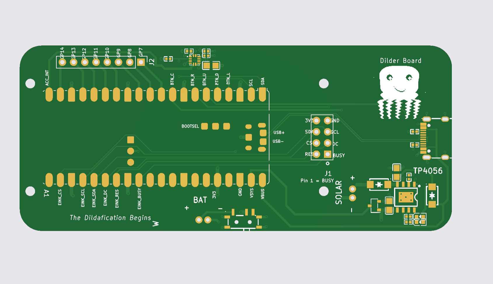{ width="720" loading=lazy }
  <figcaption>The front of the board — every pad labelled, every component placed, every signal named. "The Dildafication Begins" is the official tagline now, sorry.</figcaption>
</figure>

The front of the board carries the brain (a Raspberry Pi Pico 2 W), the charger circuit (TP4056), the USB-C port, the e-paper screen connector, a row of test pads for the buttons, the gyro, and a small mascot drawing of the octopus winking at the user.

<figure markdown="span">
  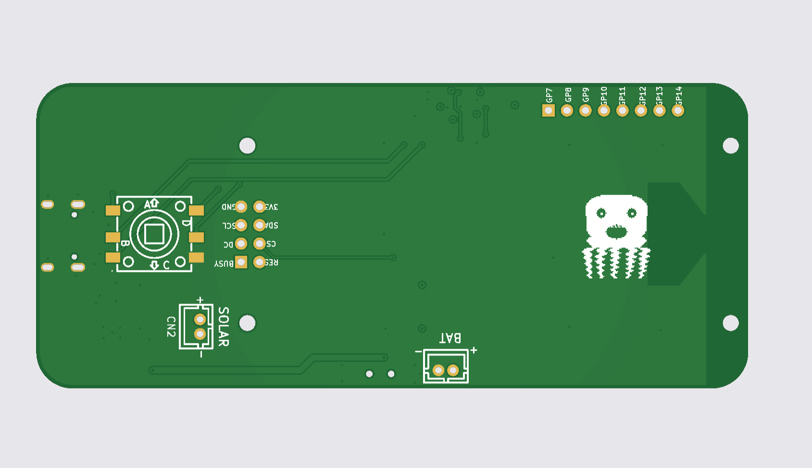{ width="720" loading=lazy }
  <figcaption>The back of the board — joystick footprint on the left, e-paper SPI breakout in the middle, solar and battery connectors, and a bigger octopus on the right.</figcaption>
</figure>

The back hosts the 5-way joystick switch (so the thumbpiece sticks out the back of the case), the JST connectors for the solar panel and the battery, and a chunky little debug header that mirrors the e-paper's SPI lines.

## The steps to get here

The journey was less "draw a circuit" and more "play detective across a stack of reference designs." Here is the friendly version of the process.

### 1. Decide what's actually on the board

I almost started this whole thing from the BOM file. That was the wrong source. The BOM had old parts on it that the project had already moved past. The **real** source of truth turned out to be the **FreeCAD model of the case** — every body in the case is a real thing that has to land somewhere on the new board. If it's in the case, it's on the board. If it's not in the case, it doesn't exist yet.

So step one was reading the case, not the parts list.

### 2. Find a working reference for every part

Rather than design any component circuit from scratch, I went hunting through the repo's stash of reference projects. For every part the case needed, I tried to find a board that someone smarter than me had already built and proven:

- For the **Pi Pico 2 W**, the official Pico carrier-board project.
- For the **TP4056 charger and battery protection**, a tiny open-source charger board.
- For the **gyro sensor on an I²C bus**, an example sensor breakout that wires up multiple I²C chips cleanly.
- For the **e-paper screen**, an existing ESP32 e-paper carrier with the SPI signals already named.
- For the **joystick footprint**, my own Rev 2 joystick PCB from last month (which finally has the right pad layout).

Eleven reference projects in total — all openable directly in KiCad, all already proven by someone else.

### 3. Wire it up in KiCad

The schematic is where you draw the *logical* picture — boxes for each part, lines between their pins, names like `SDA`, `SCL`, `EINK_CS`, `BTN_UP` showing how things connect. This is the wiring diagram side of the work.

<figure markdown="span">
  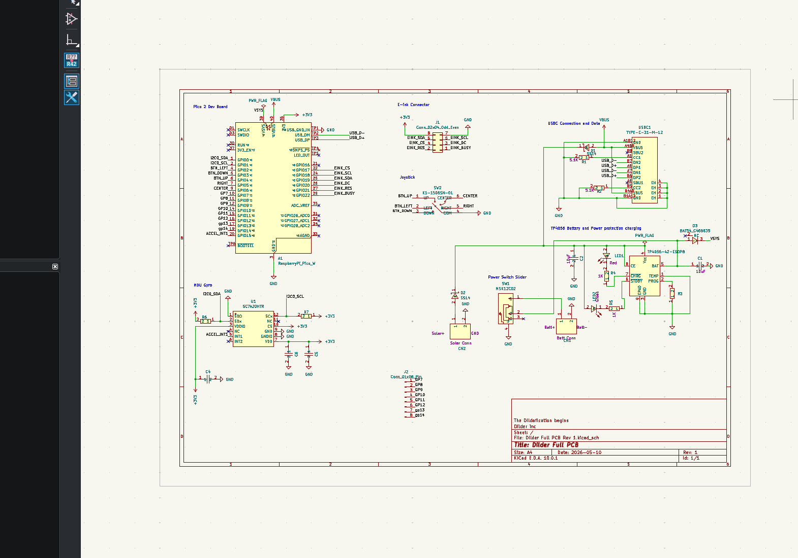{ width="900" loading=lazy }
  <figcaption>The complete Rev 1 schematic — Pico in the top-left, USB-C and TP4056 charger to the right, gyro down below, joystick and e-paper connectors in the middle. "Title: Dilder Full PCB — Rev 1 — 2026-05-10."</figcaption>
</figure>

The schematic was built sheet by sheet to mirror the case: a sheet for the Pico, a sheet for power, a sheet for the screen, a sheet for the sensors, a sheet for the buttons and joystick. Each one wires into the next via named labels — like little teleporters that say "this `SDA` is the same `SDA` over there."

### 4. Lay it out on a real rectangle

Once the schematic was right, the layout work began — taking that logical wiring picture and turning it into a physical 3D object. Every component gets dragged onto a green rectangle the size of the inside of the case, then every signal gets a copper wire ("trace") drawn between its pins. KiCad shows ghostly lines for the connections that aren't routed yet, and slowly, one trace at a time, you replace each ghost line with real copper.

<figure markdown="span">
  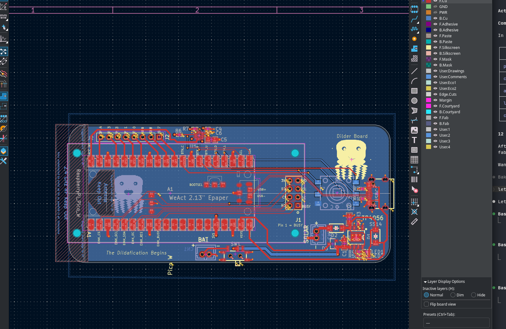{ width="720" loading=lazy }
  <figcaption>The layout editor — every part placed, every wire routed. Red lines are traces on the top of the board, blue lines are on the bottom.</figcaption>
</figure>

### 5. Set up a real 4-layer board stack

Most cheap hobby PCBs are 2-layer — copper on the top, copper on the bottom, fibreglass in the middle. This board is **4-layer**, which means two extra copper sheets sandwiched in the middle: one is a solid ground plane, the other is a solid 3.3 V plane. That makes signal routing easier (you almost never have to dodge a power wire) and keeps the board electrically quieter.

<figure markdown="span">
  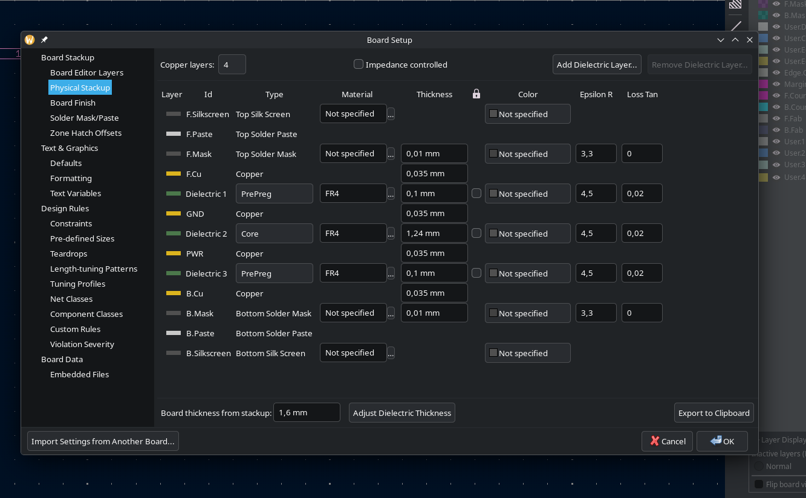{ width="520" loading=lazy }
  <figcaption>The board stackup dialog — picking which layers are copper, which are insulating "prepreg," and how thick each one is. KiCad helpfully auto-adjusts the inner thicknesses when you change one of them.</figcaption>
</figure>

<figure markdown="span">
  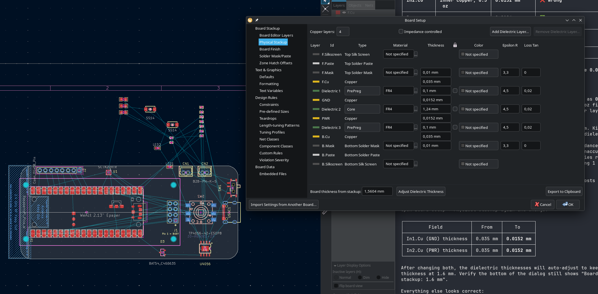{ width="720" loading=lazy }
  <figcaption>The corrected stackup — total board thickness 1.6 mm, the standard JLCPCB option for cheap 4-layer boards. Everything totals up correctly.</figcaption>
</figure>

### 6. Check the 3D preview

KiCad's most rewarding feature is the 3D viewer — once everything is routed, it renders the finished board as if you were holding it. This is the moment where weeks of clicking turns into a real-looking object.

<figure markdown="span">
  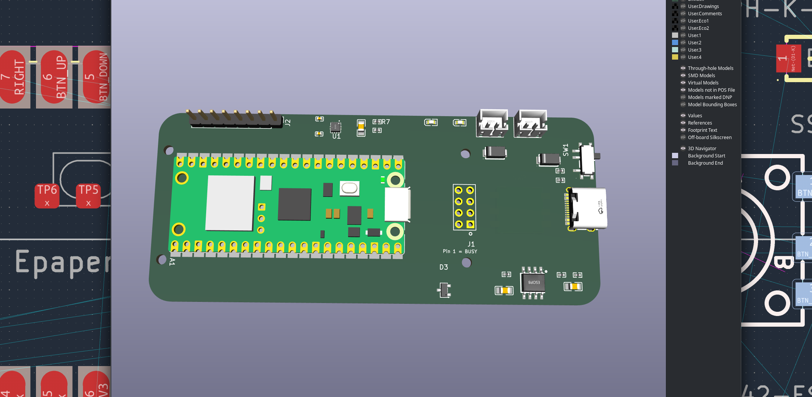{ width="720" loading=lazy }
  <figcaption>The 3D top view — Pico 2 W in its 2×20 header on the left, USB-C and SPI debug header in the middle, e-paper FPC connector on the right.</figcaption>
</figure>

<figure markdown="span">
  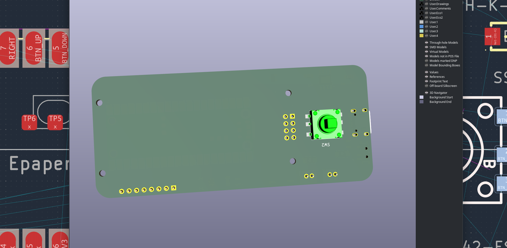{ width="720" loading=lazy }
  <figcaption>The 3D bottom view — the joystick switch sits on the back so the thumbpiece can poke out of the back of the case. Battery and solar JST connectors line the bottom edge.</figcaption>
</figure>

<figure markdown="span">
  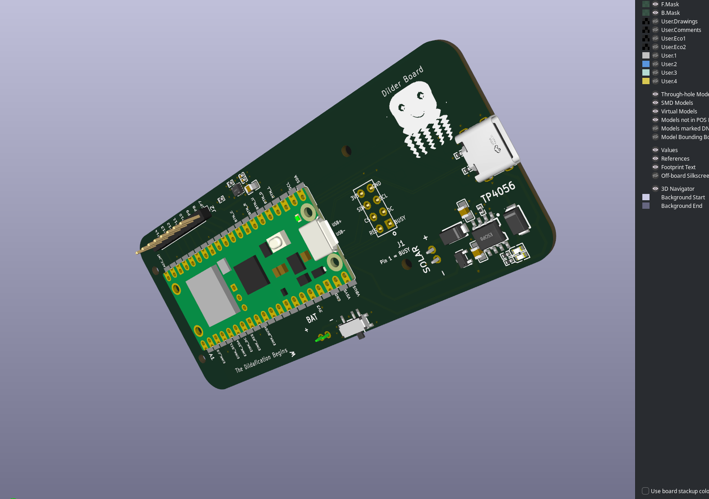{ width="600" loading=lazy }
  <figcaption>An isometric angle — the Pico module dominates the front, with the charger circuit hugging the right edge.</figcaption>
</figure>

<figure markdown="span">
  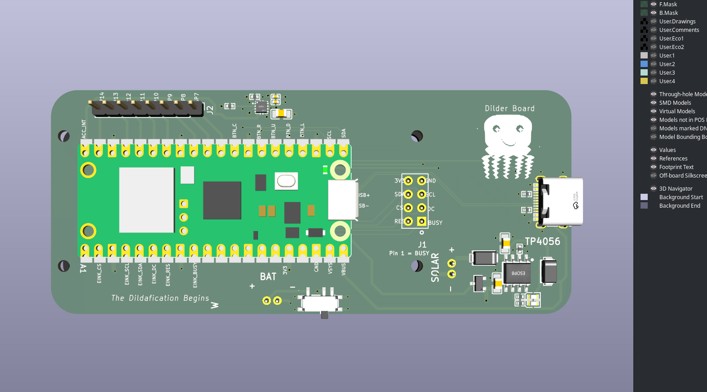{ width="600" loading=lazy }
  <figcaption>A close-up front render — every component sitting where it'll sit on the real board.</figcaption>
</figure>

<figure markdown="span">
  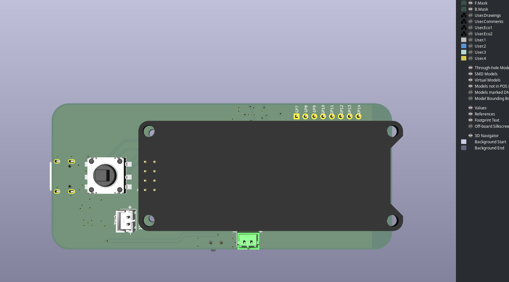{ width="720" loading=lazy }
  <figcaption>The back of the board with the joystick and the e-paper SPI breakout pads. The screen will sit right above this when assembled.</figcaption>
</figure>

### 7. Test fit the screen

The final visual check — does the e-paper screen still fit where the case says it should? Spoiler: yes.

<figure markdown="span">
  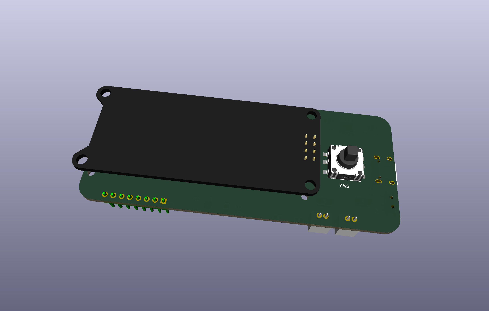{ width="900" loading=lazy }
  <figcaption>The screen floating above the board in the 3D preview — its mounting holes line up with the board's, the FPC ribbon reaches the connector, and the joystick on the back still has room to breathe.</figcaption>
</figure>

## What this milestone really means

Up to now, every Dilder unit has been a small forest of jumper wires inside a 3D-printed shell. Rev 1 of the Full Board is the moment where the project stops being a "breadboard with a case around it" and starts being **an actual hardware product**.

That's a big deal for two reasons:

- **The case can shrink.** Once the wires are inside the board, the case doesn't need internal channels for them anymore. The next case revision can be measured against the *board*, not the bag of modules.
- **Building another one becomes realistic.** Sending this file off to a fab, getting five boards back, and handing one to a friend is now a one-shot affair rather than an afternoon of soldering rainbow ribbon.

## What's next

A few clear next steps:

1. **Order the board.** Send the Gerbers off to JLCPCB and get the first batch of physical boards in hand.
2. **Solder the extended components.** The fancier surface-mount parts (USB-C connector, TP4056 chip, IMU sensor, slide switch, decoupling capacitors) get hand-soldered onto the bare boards once they arrive.
3. **Design a new FreeCAD case around it.** Now that the board is the new fixed shape, the case has to be re-measured and re-modelled around it — slimmer, smarter, with no leftover rails for modules that no longer exist.

It took two months of breadboards, dozens of FreeCAD prints, and eleven reference designs to get here — but the board is real, the silkscreen is checked, and the dildafication has officially begun.
