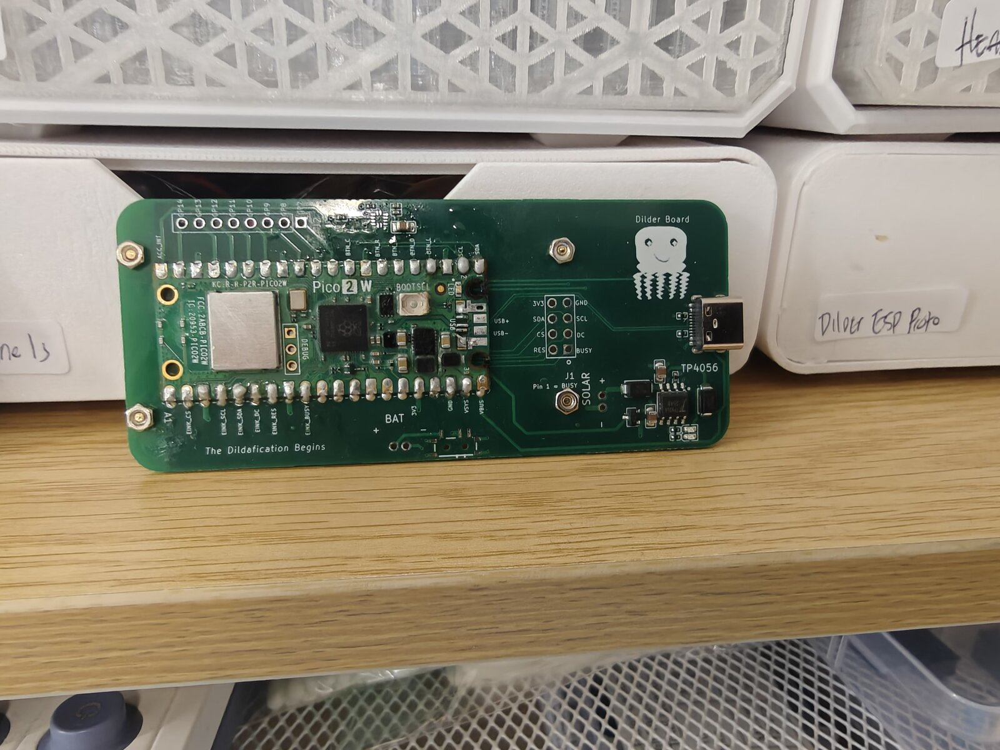
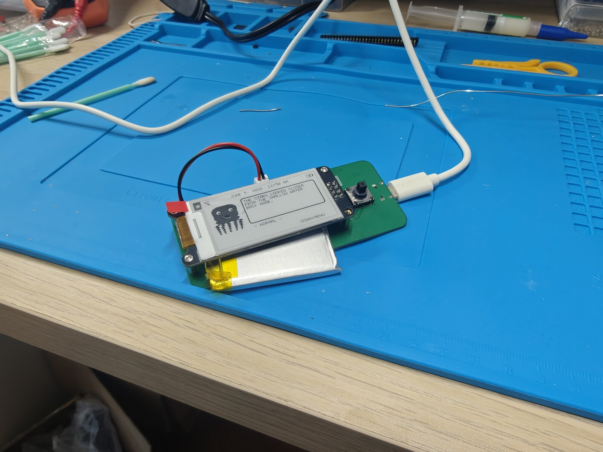
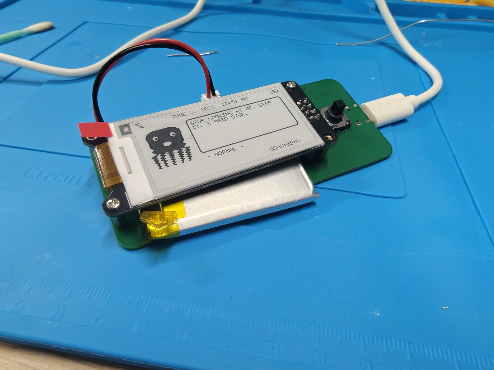
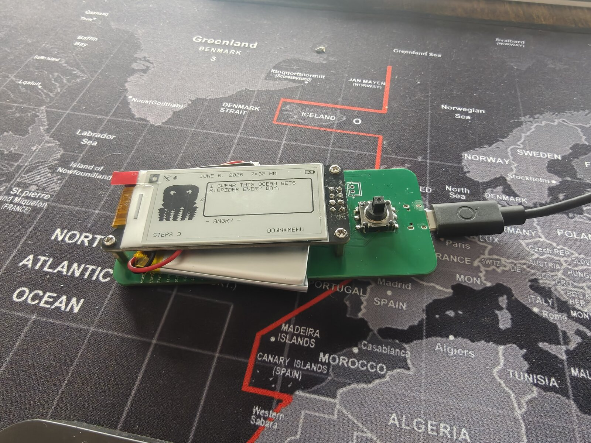

# Firmware Comes Alive: Bluetooth Pairing, Auto-Rotate, and the Custom Dilder Board

The custom **Dilder Board** is off the bench and running the real firmware — and it has grown up a lot. The octopus now rotates with the device, counts your steps, remembers your WiFi, flashes itself over the air, and as of this week, **pairs to your phone over Bluetooth LE**. Here's the milestone, start to finish.

<!-- more -->

<figure markdown="span">
  { width="640" loading=lazy }
  <figcaption>The custom Dilder Board — Pico 2 W, TP4056 charging, solar input pads, USB-C. "The Dildafication Begins."</figcaption>
</figure>

## From bench to brain

First power-up on the custom board: e-ink wired over SPI, a LiPo on the JST, USB-C for power and charging. No enclosure, no ceremony — just the board, the display, and the octopus booting on real hardware.

<figure markdown="span">
  { width="420" loading=lazy }
  <figcaption>First power on the custom board — LiPo + USB-C, e-ink alive on the bench.</figcaption>
</figure>

<figure markdown="span">
  { width="420" loading=lazy }
  <figcaption>"STOP LOOKING AT ME. STOP IT. I SAID STOP." — live clock, mood line, and menu prompt.</figcaption>
</figure>

## What got built this milestone

A succinct run-down of the work, in the order it happened:

1. **WiFi OTA bootloader (picowota → RP2350).** Ported the picowota bootloader to the Pico 2 W's RP2350 so the board can be reflashed over WiFi — hold the joystick **UP** at boot to drop into the OTA loader, then push a new image from the DevTool. No BOOTSEL, no cable.
2. **Accelerometer brought online.** The on-board **SC7A20** (I²C, addr `0x18`) is read live — the basis for orientation and step counting.
3. **Display auto-rotation.** An `atan2` tilt classifier picks one of three orientations and re-renders the whole UI — including a dedicated **tall "longways" layout** with a speech-bubble quote above the octopus.
4. **Activity tracker.** A low-power pedometer counts **steps** and active minutes from the accelerometer, shown right on the home screen.
5. **Saved WiFi networks.** Credentials are cached to the last flash sector (survives reboot *and* OTA), so reconnecting needs no password re-entry. Save/forget from the menu.
6. **Faster boot.** Removed the blocking boot-time WiFi connect and trimmed startup delays.
7. **Real Bluetooth LE pairing.** A BTstack peripheral advertises as **"Dilder Hub"**, pairs with a **6-digit passkey shown on the e-ink**, and exposes a tiny GATT service so a phone can read live mood + step count and poke the device.
8. **Status icons.** WiFi, **Bluetooth (shown when paired)**, and battery now live in the top bar — in both orientations.

## Auto-rotate + the activity tracker

Tilt the board and the UI follows. In the wide hold you get the octopus, a mood line, and the day's step count along the bottom; the top bar carries the WiFi / Bluetooth / battery icons.

<figure markdown="span">
  { width="640" loading=lazy }
  <figcaption>Wide layout — ANGRY mood, live step count, and the new WiFi/BT/battery status bar.</figcaption>
</figure>

Rotate to portrait and the firmware switches to the **tall "longways" layout**: a status bar up top, a speech-bubble quote with a little tail caret, and the octopus anchored at the bottom over the mood + step line.

<figure markdown="span">
  { width="420" loading=lazy }
  <figcaption>Tall "longways" layout — speech-bubble quote, HOMESICK octopus, and the Bluetooth icon lit in the status bar (paired).</figcaption>
</figure>

## Bluetooth, the secure way

Pairing isn't "Just Works" — it's **Passkey Entry with MITM protection**. Open **Menu → Bluetooth**, find *Dilder Hub* on your phone, and the e-ink shows a **6-digit code** to type in. Once bonded, a small custom GATT service lets a phone:

- **Read / subscribe** to a live status string (`MOOD STEPS`) — push-notified whenever it changes.
- **Write a command byte** — currently nudging the octopus to a fresh quote, with room to grow into real remote control.

When bonded, the **Bluetooth rune lights up in the top status bar** next to WiFi — in either orientation.

## Current capabilities

The Dilder firmware now does, on the custom board:

- :material-rotate-3d-variant: **Auto-rotating UI** — three orientations, dedicated tall + wide layouts
- :material-walk: **Step + activity tracking** from the on-board accelerometer
- :material-wifi: **Saved WiFi** with NTP clock sync; save/forget networks in-menu
- :material-bluetooth: **Bluetooth LE pairing** — passkey-secured, phone-readable mood/steps
- :material-cloud-upload: **WiFi OTA** firmware updates (+ USB reflash with no BOOTSEL button)
- :material-battery-charging: **LiPo power + USB-C charging** via on-board TP4056
- :material-emoticon-outline: **16 moods**, animated octopus, and a deep quote bank on a 2.13" e-ink

Next up: wiring specific phone-side command bytes to real actions, and folding all of this into the translucent Mk2 case.
