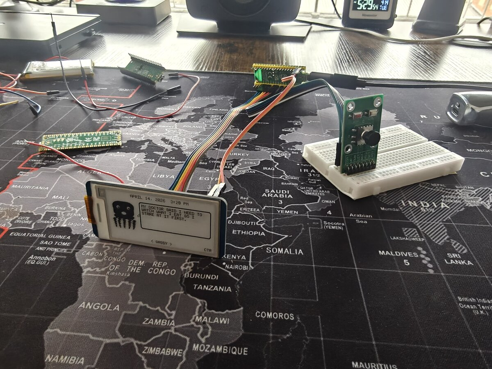
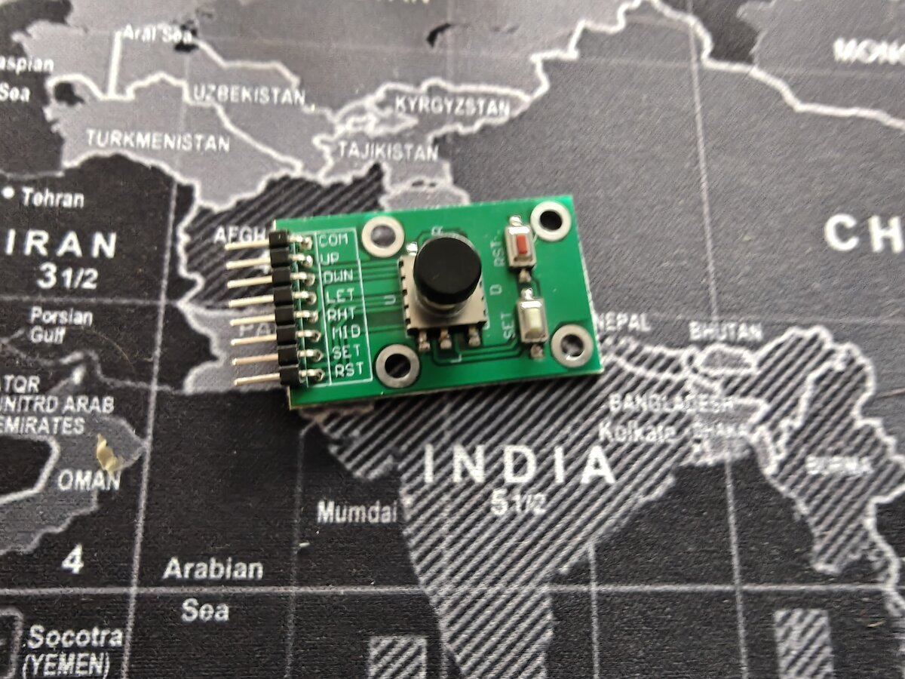
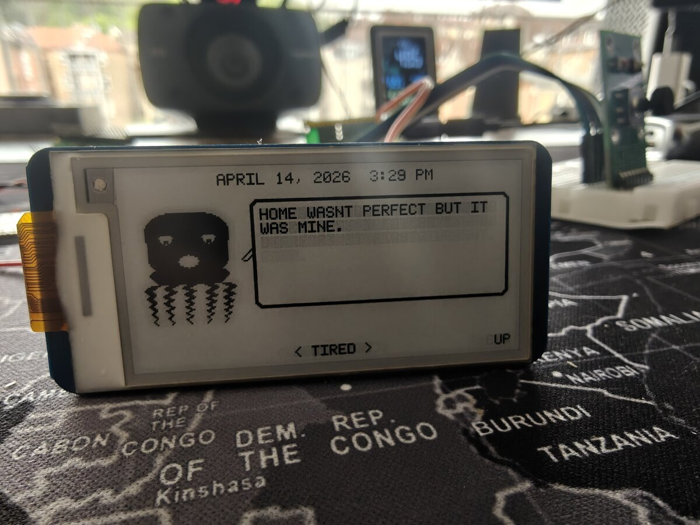
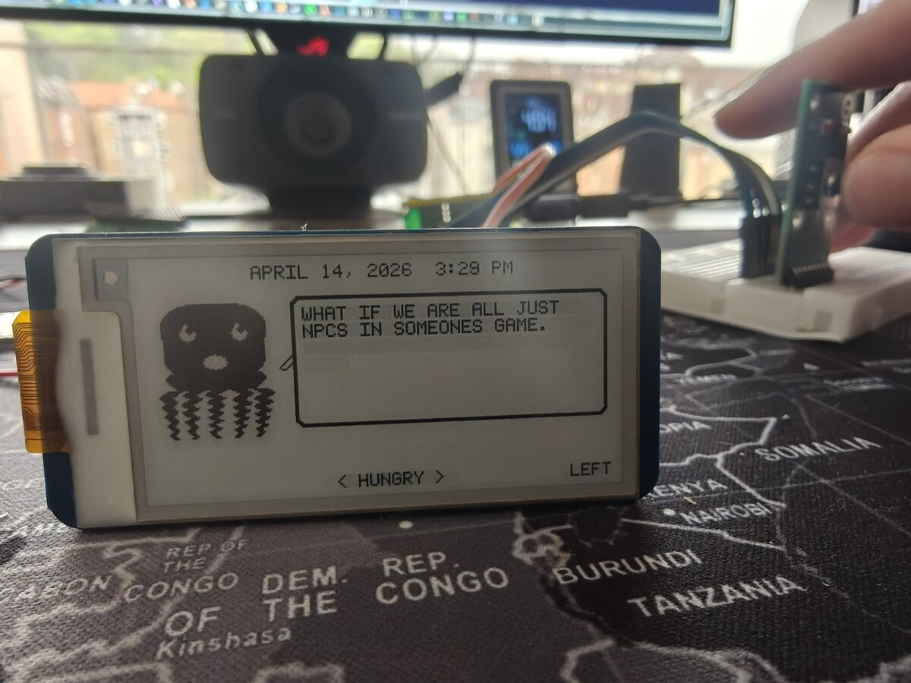
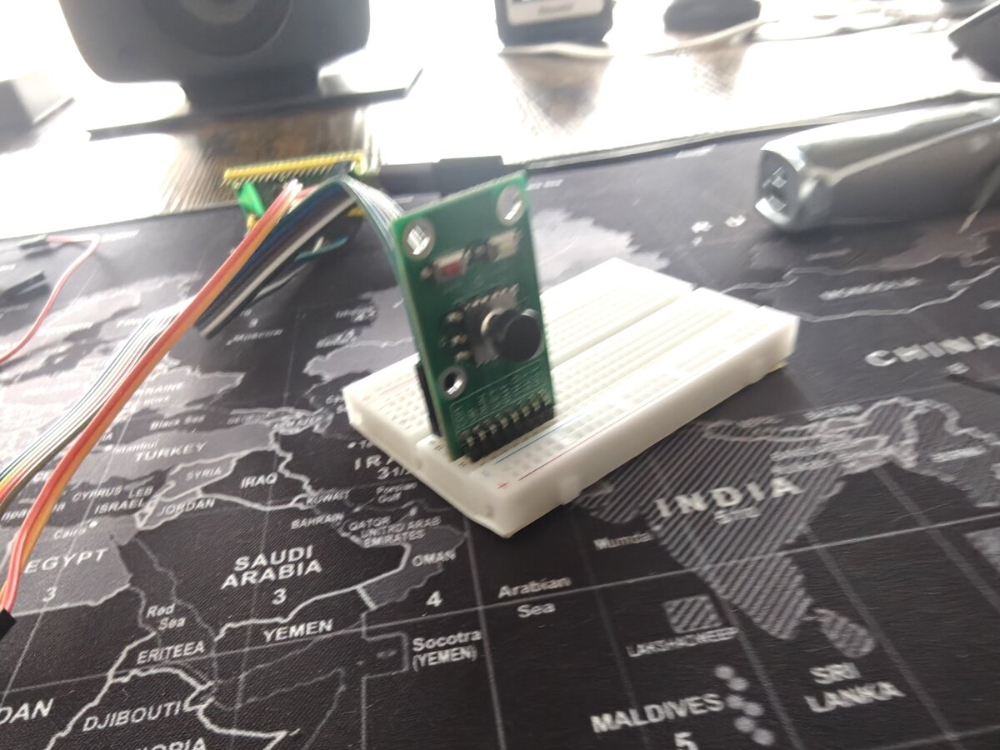

# First Real Input — Joystick Wired, Octopus Responds

The octopus can finally hear us. For the first time, the Dilder responds to physical input — a 5-way joystick module wired to the Pico W's GPIO pins, driving mood changes on the e-ink display in real time.

<!-- more -->

## The Build Session

Today was all about getting physical input working. Until now, the octopus was controlled entirely over serial USB — type a key, mood changes. Useful for development, but not exactly a handheld experience. Time to fix that.

### Hardware Setup

The test bench is coming together. The Pico W sits on a breadboard with the Waveshare Pico-ePaper-2.13 connected via jumper wires from the 8-pin breakout header, and the DollaTek 5-way joystick module plugged into the board alongside it.

<figure markdown="span">
  { width="600" loading=lazy }
  <figcaption>The full test bench — Pico W, e-Paper display running the octopus, and joystick module on the breadboard</figcaption>
</figure>

<figure markdown="span">
  { width="400" loading=lazy }
  <figcaption>DollaTek 5-way navigation module — UP, DOWN, LEFT, RIGHT, and CENTER click</figcaption>
</figure>

The joystick wiring is straightforward — five GPIO pins (GP2–GP6) with internal pull-ups, active LOW when pressed. COM goes to ground. No external resistors, no level shifting, just direct digital input.

### The Firmware

The new **Joystick Mood Selector** builds on the existing mood-selector firmware:

- **LEFT / RIGHT** — cycle through all 16 moods
- **UP** — random mood
- **DOWN** — new random quote (same mood)
- **CENTER** — reset to SASSY

The last input pressed is shown on the right side of the status bar, so you can see exactly what the device registered.

<figure markdown="span">
  { width="600" loading=lazy }
  <figcaption>"HOME WASNT PERFECT BUT IT WAS MINE." — TIRED mood, triggered by UP (random). The input indicator shows "UP" on the bottom right.</figcaption>
</figure>

<figure markdown="span">
  { width="600" loading=lazy }
  <figcaption>"WHAT IF WE ARE ALL JUST NPCS IN SOMEONES GAME." — HUNGRY mood, navigated to with LEFT. The octopus has opinions.</figcaption>
</figure>

### The Wiring Mistake

One bug that wasn't in the code: the CENTER button didn't register at first. Turns out the wire was plugged into **pin 8 (GND)** instead of **pin 9 (GP6)** — they're right next to each other on the Pico W. Classic breadboard mixup. Moved the wire one row over, and center clicks worked immediately.

Lesson: when a single GPIO input doesn't work but others do, check the physical wiring before debugging the code.

## Battery — Ready for Planning

The LiPo battery is also on the desk now — an **InnCraft Energy 503450**, 1000mAh, 3.7V with a Molex 1.25mm 2-pin connector.

<figure markdown="span">
  { width="500" loading=lazy }
  <figcaption>InnCraft Energy 503450 — 1000mAh, 3.7V, Molex 51021-0200 connector. Wires directly to VSYS (pin 39).</figcaption>
</figure>

The [Battery Wiring Guide](../../docs/hardware/battery-wiring.md) is already written with three wiring options (direct, TP4056, PowerBoost). Next step: wire it up on the breadboard and test untethered operation. The Pico W's VSYS pin accepts 1.8–5.5V, and the LiPo's 3.0–4.2V range sits right in the middle — no boost converter needed.

Estimated battery life in Tamagotchi mode (10 min active, 50 min sleep per hour): **~6.8 days**.

## What's Next

- Wire the battery to VSYS and test untethered operation
- Add battery voltage monitoring (GPIO29 / ADC3 — already documented)
- Build a battery indicator for the e-ink display
- Wire and test the remaining peripherals (GPS, HC-SR04)
- Start building the game loop state machine

The octopus has eyes, a mouth, opinions, and now it can hear you push a button. We're getting closer to a real pet.

<figure markdown="span">
  { width="500" loading=lazy }
  <figcaption>DollaTek joystick seated on the breadboard, wired to the Pico W via jumper cables</figcaption>
</figure>
