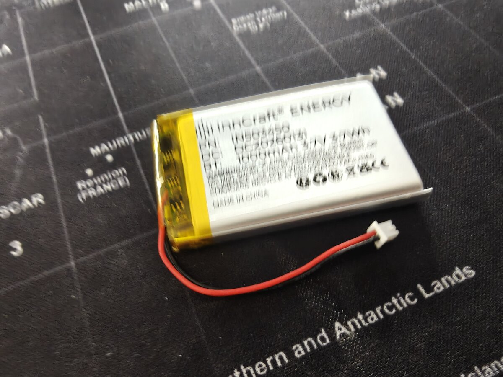

# LiPo Battery — Wiring & Setup Guide

Complete wiring, safety, charging, and testing instructions for powering the Dilder with a 3.7V LiPo battery connected to the Raspberry Pi Pico W.

---

## Table of Contents

- [Overview](#overview)
- [Battery Specifications](#battery-specifications)
- [Connector Details](#connector-details)
- [Safety First](#safety-first)
    - [LiPo Hazards](#lipo-hazards)
    - [Safe Handling Rules](#safe-handling-rules)
    - [Storage and Disposal](#storage-and-disposal)
- [How the Pico W Accepts Battery Power](#how-the-pico-w-accepts-battery-power)
    - [VSYS Pin](#vsys-pin)
    - [Why No Boost Converter Is Needed](#why-no-boost-converter-is-needed)
    - [USB and Battery Coexistence](#usb-and-battery-coexistence)
- [Wiring Options](#wiring-options)
    - [Option A — Direct to VSYS (Simplest)](#option-a-direct-to-vsys-simplest)
    - [Option B — Via TP4056 Charging Module (Recommended)](#option-b-via-tp4056-charging-module-recommended)
    - [Option C — Via Adafruit PowerBoost 500C (Premium)](#option-c-via-adafruit-powerboost-500c-premium)
- [Step-by-Step Wiring — Option A (Direct)](#step-by-step-wiring-option-a-direct)
    - [Step 1 — Verify Connector Polarity](#step-1-verify-connector-polarity)
    - [Step 2 — Power Off Everything](#step-2-power-off-everything)
    - [Step 3 — Prepare the Connector](#step-3-prepare-the-connector)
    - [Step 4 — Connect to Pico W](#step-4-connect-to-pico-w)
    - [Step 5 — First Power-On Test](#step-5-first-power-on-test)
- [Step-by-Step Wiring — Option B (TP4056)](#step-by-step-wiring-option-b-tp4056)
    - [Step 1 — Identify TP4056 Pads](#step-1-identify-tp4056-pads)
    - [Step 2 — Connect Battery to TP4056](#step-2-connect-battery-to-tp4056)
    - [Step 3 — Connect TP4056 Output to Pico W](#step-3-connect-tp4056-output-to-pico-w)
    - [Step 4 — Test Charging](#step-4-test-charging)
    - [Step 5 — Test Battery Power](#step-5-test-battery-power)
- [Wiring Diagrams](#wiring-diagrams)
    - [Option A — Direct Wiring](#option-a-direct-wiring)
    - [Option B — TP4056 Wiring](#option-b-tp4056-wiring)
- [Battery Voltage Monitoring](#battery-voltage-monitoring)
    - [How It Works](#how-it-works)
    - [Reading Battery Voltage (C)](#reading-battery-voltage-c)
    - [Reading Battery Voltage (MicroPython)](#reading-battery-voltage-micropython)
    - [Voltage-to-Percentage Table](#voltage-to-percentage-table)
- [USB Detection](#usb-detection)
- [Battery Life Estimates](#battery-life-estimates)
- [Charging Behavior](#charging-behavior)
- [Integration with Existing Hardware](#integration-with-existing-hardware)
- [Troubleshooting](#troubleshooting)

---

## Overview

The InnCraft Energy 1000mAh LiPo battery provides portable power for the Dilder, enabling untethered operation for approximately **6.8 days** in Tamagotchi mode (10 min active per hour, 50 min deep sleep). The battery connects to the Pico W's **VSYS** pin, which accepts 1.8–5.5V — a perfect match for the LiPo's 3.0–4.2V operating range.

This guide covers three wiring options from simplest to most featured, with the TP4056 charging module recommended for most builders.

---

## Battery Specifications

<figure markdown="span">
  { width="450" loading=lazy }
  <figcaption>InnCraft Energy 503450 — 1000mAh, 3.7V. Red (+) and black (-) wires terminate in a Molex 51021-0200 1.25mm connector.</figcaption>
</figure>

| Attribute | Value |
|-----------|-------|
| **Product** | InnCraft Energy Lithium Polymer Battery |
| **Model** | 503450 |
| **Nominal voltage** | 3.7V |
| **Full charge voltage** | 4.2V |
| **Cutoff voltage** | 3.0V (do not discharge below this) |
| **Capacity** | 1000mAh (3.7Wh) |
| **Dimensions** | 51 x 34 x 5mm |
| **Weight** | ~20g |
| **Connector** | 2P Molex 51021-0200, 1.25mm pitch |
| **Chemistry** | Lithium polymer (LiPo) |
| **Amazon link** | [B0F88RQX7C](https://www.amazon.de/dp/B0F88RQX7C) |

---

## Connector Details

This battery uses a **Molex 51021-0200** connector with **1.25mm pin pitch** — this is smaller than the common JST PH 2.0mm connector found on Adafruit batteries.

| Property | This Battery | Adafruit Standard |
|----------|-------------|-------------------|
| Connector | Molex 51021-0200 | JST PH 2.0 |
| Pin pitch | 1.25mm | 2.0mm |
| Pins | 2 (+ and -) | 2 (+ and -) |

!!! warning "Connector compatibility"
    The 1.25mm Molex connector will **not** plug into a JST PH 2.0mm socket. If you're using a TP4056 module or PowerBoost with a JST PH socket, you'll need to either:

    - **Cut the connector and solder wires directly** to the charging module pads (recommended for prototyping)
    - **Use a Molex 51021-0200 female socket** on a breakout or adapter
    - **Replace the connector** with a JST PH 2.0mm plug (careful with polarity)

### Pin Identification

The Molex connector has two wires:

| Wire Color | Function | Notes |
|------------|----------|-------|
| **Red** | Positive (+) | Connects to VSYS or charger BAT+ |
| **Black** | Negative (-) | Connects to GND or charger BAT- |

!!! danger "Always verify polarity with a multimeter"
    Chinese-manufactured LiPo cells sometimes have **reversed polarity** compared to what wire colors suggest. Before connecting anything, measure the voltage between the two pins with a multimeter. The pin reading **+3.7V** is positive, regardless of wire color.

---

## Safety First

### LiPo Hazards

Lithium polymer batteries store significant energy in a small package. Mishandling can cause:

- **Fire** — from short circuits, overcharging, or physical puncture
- **Explosion** — from overcharging above 4.2V or extreme heat
- **Chemical burns** — from swelling or rupture

These risks are manageable with basic precautions. Millions of devices use LiPo safely every day.

### Safe Handling Rules

1. **Never short-circuit** the battery — keep exposed wire ends insulated when not connected
2. **Never charge above 4.2V** — always use a proper LiPo charger (TP4056 or equivalent)
3. **Never discharge below 3.0V** — implement a low-voltage cutoff in software or use a TP4056 with protection
4. **Never puncture, crush, or bend** the battery pouch
5. **Never leave charging unattended** for the first few cycles with a new battery
6. **Stop using immediately** if the battery swells, gets hot, or smells unusual
7. **Keep away from metal objects** that could bridge the terminals (coins, keys, etc.)
8. **Charge on a fire-safe surface** — not on carpet, bed, or near flammable materials

### Storage and Disposal

| Scenario | Action |
|----------|--------|
| Short-term storage (weeks) | Charge to ~3.8V (storage voltage), store at room temperature |
| Long-term storage (months) | Same as above, check voltage every 2–3 months |
| Disposal | Take to electronics recycling — **never throw in regular trash** |
| Swollen battery | Place in a fireproof container, take to hazardous waste disposal |

---

## How the Pico W Accepts Battery Power

### VSYS Pin

The Pico W has a dedicated external power input:

| Pin | Name | Function |
|-----|------|----------|
| Pin 39 | **VSYS** | External power input, 1.8–5.5V |
| Pin 38 | **GND** | Ground return |

VSYS feeds the Pico W's onboard RT6150B buck-boost regulator, which converts any voltage in the 1.8–5.5V range down to the 3.3V needed by the RP2040 chip and peripherals.

### Why No Boost Converter Is Needed

A 3.7V LiPo operates between **3.0V (empty) and 4.2V (full)**. This entire range falls within the Pico W's VSYS acceptance window of 1.8–5.5V. The battery connects directly — no voltage conversion required.

```
LiPo voltage range:    3.0V ──────────── 3.7V ──────────── 4.2V
                        ▼                  ▼                  ▼
Pico W VSYS range:  [1.8V ─────────────────────────────────── 5.5V]
                     ^^^^^^^^^^^^^^^^^^^^^^^^^^^^^^^^^^^^^^^^^^^^^^^^
                     Entire LiPo range sits comfortably inside VSYS range
```

### USB and Battery Coexistence

The Pico W has a built-in Schottky diode between VBUS (USB 5V) and VSYS. When USB is plugged in:

- VBUS (5V) is higher than battery voltage (~3.7V)
- The diode conducts, powering VSYS from USB
- The battery is effectively disconnected (not charging, not discharging)

When USB is unplugged:

- VSYS is powered directly from the battery
- The device runs on battery seamlessly

!!! info "USB does not charge the battery"
    The Pico W has **no built-in charger**. Plugging in USB powers the board but does **not** charge the LiPo. You need a separate charging module (TP4056 or PowerBoost) for that.

---

## Wiring Options

### Option A — Direct to VSYS (Simplest)

```
LiPo (+) ──► VSYS (pin 39)
LiPo (-) ──► GND  (pin 38)
```

**Pros:** Zero additional components, simplest wiring, no cost.
**Cons:** No charging circuit (must remove and charge externally), no over-discharge protection (must implement in software), no low-battery indicator hardware.

**Best for:** Initial testing and development on the breadboard.

### Option B — Via TP4056 Charging Module (Recommended)

```
USB 5V ──► TP4056 IN+      LiPo (+) ◄── TP4056 BAT+
GND    ──► TP4056 IN-      LiPo (-) ◄── TP4056 BAT-
                            TP4056 OUT+ ──► VSYS (pin 39)
                            TP4056 OUT- ──► GND  (pin 38)
```

**Pros:** USB charging (~€1.50), over-discharge protection built into the DW01A chip on most modules, charge status LEDs (red=charging, blue/green=done).
**Cons:** Partial load sharing only (some modules cut power briefly during charge-to-done transition), adds ~25x15mm board.

**Best for:** Permanent builds and the 3D-printed enclosure.

### Option C — Via Adafruit PowerBoost 500C (Premium)

```
USB 5V ──► PowerBoost VIN      LiPo (+) ◄── PowerBoost BAT
GND    ──► PowerBoost GND      LiPo (-) ◄── PowerBoost GND
                                PowerBoost 5V  ──► VBUS (pin 40)
                                PowerBoost GND ──► GND  (pin 38)
                                PowerBoost LBO ──► GP14 (optional)
```

**Pros:** Full load sharing (use while charging seamlessly), 5V boosted output, low-battery output pin for alerts, high-quality components.
**Cons:** ~€16, larger board, outputs to VBUS not VSYS.

**Best for:** Premium builds where uninterrupted use-while-charging is important.

---

## Step-by-Step Wiring — Option A (Direct)

### Step 1 — Verify Connector Polarity

Before connecting anything:

1. Set your multimeter to DC voltage mode (20V range)
2. Touch the red probe to one connector pin, black probe to the other
3. Reading shows **+3.7V** (approximately) — the red probe pin is **positive**
4. If reading shows **-3.7V**, swap probes — the other pin is positive
5. Mark the positive wire if it's not already clearly red

### Step 2 — Power Off Everything

1. Unplug the Pico W's USB cable
2. Disconnect any other power sources
3. Ensure no wires are touching the battery terminals

### Step 3 — Prepare the Connector

The Molex 1.25mm connector is too small to plug directly into a breadboard. You have two approaches:

**Approach A — Jumper wire adapter (no soldering):**

1. Cut the Molex connector off, leaving ~30mm of wire
2. Strip 5mm of insulation from each wire end
3. Insert each bare wire into a male-to-male jumper wire's crimp end, or use a screw terminal breakout

**Approach B — Solder to breadboard wires (more reliable):**

1. Cut the Molex connector off, leaving ~30mm of wire
2. Strip 5mm of insulation from each wire end
3. Solder each wire to a male header pin or jumper wire
4. Apply heat shrink tubing over each joint

!!! tip "Keep the connector"
    If you plan to swap batteries or use a charging module with a Molex 1.25mm socket later, leave the connector intact and solder an adapter cable with a female Molex socket on one end and breadboard pins on the other.

### Step 4 — Connect to Pico W

| Battery Wire | Pico W Pin | Physical Pin |
|-------------|------------|--------------|
| **Red (+)** | VSYS | Pin 39 |
| **Black (-)** | GND | Pin 38 |

Insert the wires into the breadboard rows connected to pin 39 (VSYS) and pin 38 (GND).

!!! danger "Double-check before power-on"
    Reversing polarity **will damage the Pico W permanently**. Triple-check that positive goes to VSYS (pin 39) and negative goes to GND (pin 38).

### Step 5 — First Power-On Test

1. Ensure USB is **unplugged** (test battery power alone)
2. Insert the battery wires into the breadboard
3. The Pico W's onboard LED should light up (if firmware drives it)
4. Connect a serial terminal — if firmware is flashed, you should see output at 115200 baud
5. Verify the e-ink display refreshes normally
6. Test joystick input if wired

If nothing happens:

- Check polarity again with a multimeter
- Verify the battery is charged (should read 3.5–4.2V)
- Check for loose breadboard connections

---

## Step-by-Step Wiring — Option B (TP4056)

### Step 1 — Identify TP4056 Pads

Most TP4056 modules have these labeled pads:

```
┌─────────────────────────────┐
│  [USB-C or Micro-USB port]  │
│                             │
│  IN+  IN-   BAT+  BAT-     │
│                             │
│  OUT+  OUT-                 │
│                             │
│  [Red LED]  [Green LED]     │
└─────────────────────────────┘
```

- **IN+/IN-** — USB power input (these may be omitted if the module has a USB port, which provides the same function)
- **BAT+/BAT-** — Battery connection
- **OUT+/OUT-** — Protected output to your device

!!! info "Modules with DW01A protection IC"
    Look for a TP4056 module that includes the **DW01A** protection IC and **FS8205A** dual MOSFET. These modules have both BAT and OUT pads and provide over-discharge, over-charge, and short-circuit protection. Budget modules without protection only have BAT pads — avoid these.

### Step 2 — Connect Battery to TP4056

Since the battery has a Molex 1.25mm connector and the TP4056 typically has solder pads:

1. Cut the Molex connector off (or use an adapter cable)
2. Strip 5mm from each wire
3. Solder **red (+)** to **BAT+** pad
4. Solder **black (-)** to **BAT-** pad

### Step 3 — Connect TP4056 Output to Pico W

Using jumper wires soldered to the TP4056 OUT pads:

| TP4056 Pad | Pico W Pin | Physical Pin |
|------------|------------|--------------|
| **OUT+** | VSYS | Pin 39 |
| **OUT-** | GND | Pin 38 |

!!! warning "Use OUT, not BAT"
    Connect the Pico W to the **OUT+/OUT-** pads, not BAT+/BAT-. The OUT pads include over-discharge protection — they cut power when the battery drops below ~2.9V, preventing damage to the LiPo cell.

### Step 4 — Test Charging

1. Plug a USB cable into the TP4056 module's USB port
2. The **red LED** should illuminate — battery is charging
3. When fully charged (~1–2 hours for 1000mAh at 1A), the **green/blue LED** illuminates
4. Measure voltage across BAT+/BAT- — should read ~4.18–4.20V when full

### Step 5 — Test Battery Power

1. Unplug the USB cable from the TP4056
2. The Pico W should continue running on battery power
3. Measure voltage across OUT+/OUT- — should read the battery voltage (~3.7–4.2V)
4. Verify display and joystick function normally

---

## Wiring Diagrams

### Option A — Direct Wiring

```
                     ┌───USB───┐
              GP0  [ 1]         [40]  VBUS
              GP1  [ 2]         [39]  VSYS ◄──── LiPo RED (+)
              GND  [ 3]         [38]  GND  ◄──── LiPo BLACK (-)
              GP2  [ 4]         [37]  3V3_EN
              GP3  [ 5]         [36]  3V3(OUT)
              GP4  [ 6]         [35]  ADC_VREF
              GP5  [ 7]         [34]  GP28
              GND  [ 8]         [33]  AGND
              GP6  [ 9]         [32]  GP27
              GP7  [10]         [31]  GP26
              GP8  [11]         [30]  RUN
              GP9  [12]         [29]  GP22
              GND  [13]         [28]  GND
             GP10  [14]         [27]  GP21
             GP11  [15]         [26]  GP20
             GP12  [16]         [25]  GP19
             GP13  [17]         [24]  GP18
              GND  [18]         [23]  GND
             GP14  [19]         [22]  GP17
             GP15  [20]         [21]  GP16
                     └─────────┘

Two wires total:
  LiPo (+) ────► Pin 39 (VSYS)
  LiPo (-) ────► Pin 38 (GND)
```

### Option B — TP4056 Wiring

```
┌──────────────┐         ┌──────────────┐         ┌───USB───┐
│              │         │              │         │  Pico W  │
│   LiPo      │         │   TP4056     │         │         │
│   1000mAh   │         │              │         │         │
│              │         │ ┌──────────┐ │         │         │
│   RED (+) ──┼────────►│ │  BAT+    │ │         │         │
│              │         │ │          │ │         │         │
│  BLACK (-) ─┼────────►│ │  BAT-    │ │         │         │
│              │         │ └──────────┘ │         │         │
│  503450      │         │              │         │         │
│  3.7V        │         │ ┌──────────┐ │         │         │
└──────────────┘         │ │  OUT+ ───┼─┼────────►│ VSYS [39]
                         │ │          │ │         │         │
                         │ │  OUT- ───┼─┼────────►│ GND  [38]
                         │ └──────────┘ │         │         │
                         │              │         └─────────┘
                         │  [USB port]  │
                         │   for        │
                         │   charging   │
                         └──────────────┘
```

---

## Battery Voltage Monitoring

The Pico W has a built-in voltage divider on **GPIO29 (ADC3)** that reads the VSYS voltage. This lets you display battery percentage and implement low-voltage shutdown.

### How It Works

The Pico W's onboard circuit divides VSYS by 3 before feeding it to the ADC:

```
VSYS ──[200K]──┬──[100K]──► GND
               │
               ▼
            GPIO29 (ADC3)
            Reads VSYS / 3
```

The ADC reads 0–3.3V with 12-bit resolution (0–4095). To get the actual VSYS voltage:

```
VSYS = ADC_reading * 3.3 / 4095 * 3
```

### Reading Battery Voltage (C)

```c
#include "hardware/adc.h"

float read_battery_voltage(void) {
    adc_init();
    adc_gpio_init(29);
    adc_select_input(3);  // ADC3 = GPIO29 = VSYS/3

    uint16_t raw = adc_read();
    float voltage = raw * 3.3f / 4095.0f * 3.0f;
    return voltage;
}

// Usage:
// float v = read_battery_voltage();
// printf("Battery: %.2fV\n", v);
```

### Reading Battery Voltage (MicroPython)

```python
from machine import ADC

def read_battery_voltage():
    adc = ADC(29)          # GPIO29 = VSYS/3
    raw = adc.read_u16()   # 0–65535
    voltage = raw * 3.3 / 65535 * 3
    return voltage

# Usage:
# v = read_battery_voltage()
# print(f"Battery: {v:.2f}V")
```

### Voltage-to-Percentage Table

Approximate state-of-charge for a 3.7V LiPo cell:

| Voltage | Charge | Status |
|---------|--------|--------|
| 4.20V | 100% | Full |
| 4.10V | ~90% | |
| 3.95V | ~75% | |
| 3.80V | ~50% | Nominal |
| 3.70V | ~30% | |
| 3.60V | ~15% | Low — consider warning |
| 3.50V | ~5% | Critical — save state and sleep |
| 3.30V | ~1% | Shutdown immediately |
| 3.00V | 0% | Empty — cutoff (do not go below) |

!!! tip "Battery icon on the e-ink display"
    Use these voltage thresholds to render a battery indicator on the Dilder's display. Read voltage every 10 minutes (during the active wake period) and update the icon.

---

## USB Detection

The Pico W can detect whether USB is plugged in via **GPIO24** (active HIGH when VBUS is present):

```c
// C — check if USB is providing power
bool usb_connected = gpio_get(24);

if (usb_connected) {
    // Running on USB power — no need for battery warnings
} else {
    // Running on battery — monitor voltage
}
```

```python
# MicroPython
from machine import Pin
usb_connected = Pin(24, Pin.IN).value()
```

This is useful for:

- Suppressing low-battery warnings when USB is plugged in
- Switching between development mode (USB) and portable mode (battery)
- Enabling/disabling sleep cycles (no need to sleep when on USB power)

---

## Battery Life Estimates

Based on the Pico W's power consumption and the 1000mAh battery:

| Mode | Current Draw | Runtime |
|------|-------------|---------|
| Always active (WiFi off) | ~28mA | ~35 hours |
| Always active (WiFi on) | ~80mA | ~12.5 hours |
| Deep sleep only | ~1.0mA | ~41 days |
| **Tamagotchi mode** (10 min active / 50 min sleep per hour) | ~5.5mA avg | **~6.8 days** |
| Aggressive sleep (5 min active / 55 min sleep) | ~3.3mA avg | **~12.6 days** |

!!! info "Tamagotchi mode"
    The recommended operating mode wakes the Pico for 10 minutes each hour to check on the pet, update the display, and scan for BLE peers, then enters deep sleep for 50 minutes. This provides nearly a week of battery life on a single charge.

---

## Charging Behavior

### TP4056 Charging Specs

| Parameter | Value |
|-----------|-------|
| Charge voltage | 4.2V (precision ±1%) |
| Charge current | 1A default (adjustable via RPROG resistor) |
| Charge time (1000mAh) | ~1–1.5 hours |
| Termination current | ~50mA (switches to trickle) |
| Over-discharge cutoff | ~2.9V (DW01A protection) |
| Over-charge protection | Yes (TP4056 IC) |
| Short-circuit protection | Yes (DW01A + FS8205A) |

### Charge Status LEDs

| Red LED | Green/Blue LED | State |
|---------|---------------|-------|
| ON | OFF | Charging |
| OFF | ON | Fully charged |
| Both OFF | Both OFF | No USB power / no battery |

---

## Integration with Existing Hardware

The battery connects to the **right side** of the Pico W (pins 38–39), completely separate from the joystick (left side, pins 4–9) and display (left side, pins 11–17).

### Updated Pin Budget

| Peripheral | GPIOs / Pins | Side |
|------------|-------------|------|
| 5-way joystick | GP2–GP6 (pins 4–9) | Left |
| e-Paper display | GP8–GP13 (pins 11–17) | Left |
| Battery VSYS | Pin 39 | Right |
| Battery GND | Pin 38 | Right |
| Battery monitor | GP29 / ADC3 (internal) | N/A |
| USB detect | GP24 (internal) | N/A |
| Piezo buzzer (Phase 7) | GP15 (pin 20) | Left |
| **Free GPIO** | **GP0–1, GP7, GP14, GP16–22, GP26–28** | |

No GPIO conflicts. The battery uses only the VSYS power pin and GND — it does not consume any GPIO lines. Voltage monitoring (GP29) and USB detection (GP24) are internally routed and do not use external pins.

### Breadboard Layout

```
         Left side                         Right side
    ┌─────────────────┐              ┌─────────────────┐
    │  Joystick       │              │  Battery (+)     │
    │  GP2-GP6        │   PICO W     │  → VSYS pin 39  │
    │  pins 4-9       │              │                  │
    │                 │              │  Battery (-)     │
    │  Display SPI    │              │  → GND pin 38    │
    │  GP8-GP13       │              │                  │
    │  pins 11-17     │              │  (also: display  │
    │                 │              │   VCC on pin 36) │
    └─────────────────┘              └─────────────────┘
```

---

## Troubleshooting

| Symptom | Likely Cause | Fix |
|---------|-------------|-----|
| Pico doesn't power on from battery | Polarity reversed | Check with multimeter — **stop immediately if reversed** |
| Pico doesn't power on from battery | Battery empty | Charge via TP4056 or external charger first |
| Pico doesn't power on from battery | Loose breadboard connection | Re-seat wires in VSYS (pin 39) and GND (pin 38) |
| Battery voltage reads 0V | Battery protection tripped | Some batteries have a built-in protection circuit that latches off; connect to charger briefly to reset |
| TP4056 red LED doesn't light | No USB power to TP4056 | Check USB cable (some are charge-only with no data), try a different cable |
| TP4056 red LED blinks | Bad battery connection | Check BAT+/BAT- solder joints |
| Battery gets warm during charging | Normal | Slight warmth is normal; if too hot to touch, disconnect immediately |
| Battery swelling | Damaged cell | **Stop using immediately** — place in fireproof container and dispose properly |
| Voltage reading is inaccurate | ADC noise | Average multiple readings (10+ samples); ensure ADC_VREF is stable |
| Display flickers on battery | Voltage sag during refresh | e-ink refresh draws ~26mW; verify battery is above 3.5V |
| Pico resets when display refreshes | Battery nearly empty | The display refresh spike can cause a brown-out; implement low-voltage cutoff at 3.5V |
| USB power doesn't take over from battery | Normal with direct wiring | The Schottky diode means USB will power VSYS when plugged in, but the battery is still connected (just not discharging significantly) |

---

## Related Pages

- [Wiring & Pinout](wiring-pinout.md) — Full GPIO pin map and display wiring
- [Joystick Wiring](joystick-wiring.md) — 5-way navigation button setup
- [Materials List](materials-list.md) — All components for the build
- [Pico W Reference](../reference/pico-w.md) — Full Pico W technical specifications
- [Enclosure Design](enclosure-design.md) — 3D-printed case with battery bay
