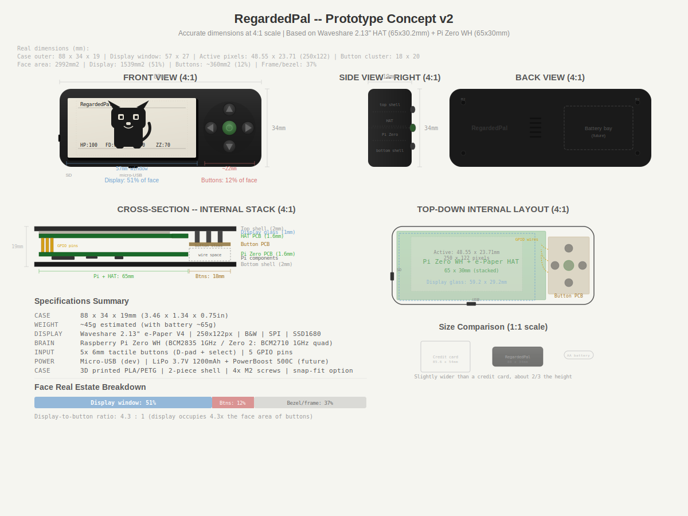

# Enclosure Design

Design specifications and constraints for the Dilder 3D-printed case.

---

## Form Factor

**Style:** Landscape rectangle — "iPod Nano" layout with display dominating the left face and a compact button cluster on the right.

**Concept renders:**

### v1 — Initial rough layout

### v2 — Dimension-accurate revision (current reference)

---

## v2 Dimensions

| Metric | Value |
|--------|-------|
| Case outer dimensions | 88 × 34 × 19mm |
| Display window cutout | 57 × 27mm |
| Active pixel area | 48.55 × 23.71mm (250×122 px) |
| Button cluster width | ~22mm |
| Button center-to-center | ~10mm |
| Display face coverage | 51% |
| Button face coverage | 12% |
| Display-to-button ratio | 4.3 : 1 |
| Estimated weight | ~45g bare / ~65g with battery |
| Size reference | Slightly wider than a credit card, ~2/3 the height |

---

## Component Dimensions

Sourced from official datasheets and measured hardware.

| Component | Dimension | Source |
|-----------|-----------|--------|
| Pi Zero board | 65 × 30 × 5mm | Official Raspberry Pi spec |
| Waveshare HAT board | 65 × 30.2mm | Waveshare specification |
| Display glass outline | 59.2 × 29.2 × 1.05mm | V3/V4 specification PDF |
| Display active area | 48.55 × 23.71mm | V3/V4 specification PDF |
| Dot pitch | 0.194 × 0.194mm | V3/V4 specification PDF |
| Pi + HAT stack height | ~15mm (with header) | Measured |
| 6×6mm tactile button | 6 × 6 × 4.3–9.5mm | Standard spec |

---

## Design Constraints

These constraints must be satisfied by any enclosure design:

1. **Display cutout:** 57 × 27mm with 1mm case lip overlap around display glass
2. **Button holes:** 5× circular apertures, ~7mm diameter, d-pad cross pattern with ~10mm center-to-center
3. **USB access:** Micro-USB slot on bottom edge (power and data during development)
4. **SD card access:** Slot on left edge (SD card can be removed without disassembly)
5. **Assembly:** 2-piece shell (top + bottom), 4× M2 corner screws
6. **Shell seam:** Horizontal split at case midpoint (~9.5mm from each face)
7. **Battery bay:** Reserved space on right side behind button PCB — 30 × 19mm footprint (Phase 6)
8. **Ventilation:** 5× slot vents on back panel

---

## Material Options

| Material | Pros | Cons |
|----------|------|------|
| PLA | Easy to print, good detail, cheap | Brittle, warps in heat |
| PETG | Tougher than PLA, better heat resistance | Slightly harder to print, less detail |
| ABS | Good mechanical properties | Warps badly without enclosure, fumes |
| ASA | Weather resistant, UV stable | Expensive, similar print difficulty to ABS |

**Recommendation for prototype:** PLA. Fast to iterate, lowest barrier to getting prints done. Switch to PETG or ASA for a final build.

---

## Future Revisions

- **v3:** Incorporate real component fits once hardware is in hand — verify Pi + HAT stack height, button stem height clearance
- **v4:** Add lanyard loop, redesign battery bay for specific battery model
- **Final:** Remove breadboard references, finalize internal PCB mount points
