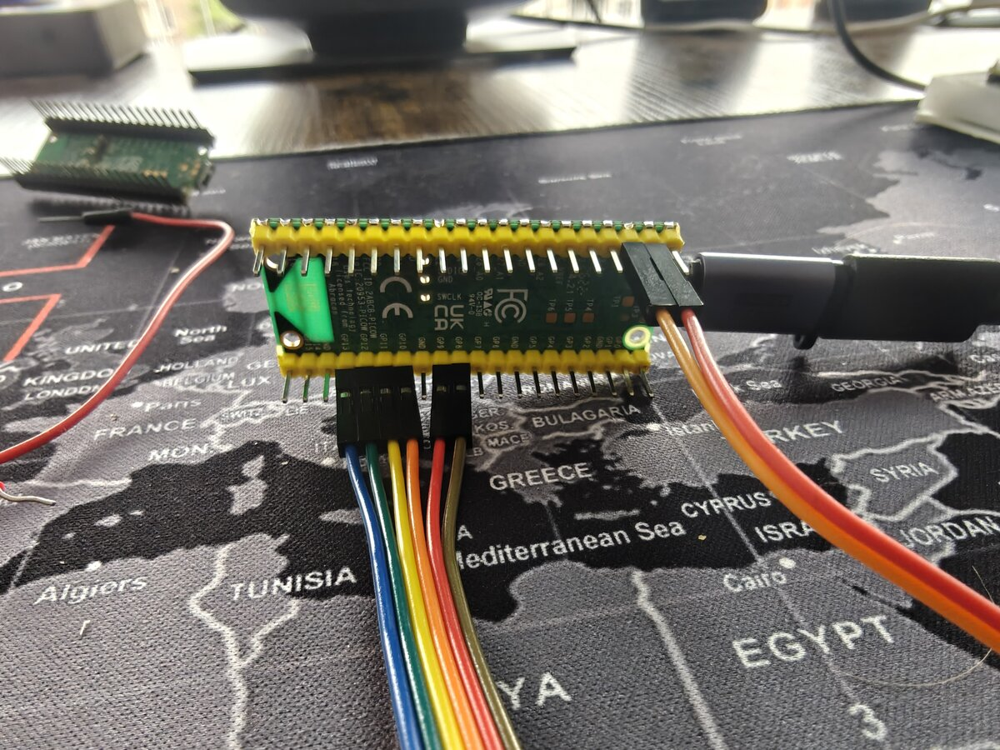

# Wiring & Pinout

GPIO assignments and breadboard wiring for the Dilder test bench (Pico W).

<figure markdown="span">
  { width="500" loading=lazy }
  <figcaption>Pico W GPIO header with jumper wires connected to the e-Paper display's 8-pin breakout</figcaption>
</figure>

Full official hardware reference docs:

- [Raspberry Pi Pico W reference](../reference/pico-w.md)
- [Waveshare Pico-ePaper-2.13 reference](../reference/waveshare-eink.md)

---

## Display Hardware — Waveshare Pico-ePaper-2.13

The Waveshare Pico-ePaper-2.13 is a **Pico-native module** with a **40-pin female GPIO header** on the back — designed to plug directly onto the Raspberry Pi Pico W's male header pins. When seated on the Pico, all SPI, control, and power connections are made automatically through the header.

!!! tip "Direct plug vs. breadboard"
    You can plug the module straight onto the Pico W for a compact setup with no wiring. For breadboard prototyping (where you need access to all Pico pins for other peripherals like the joystick, GPS, etc.), use the module's **8-pin breakout header** with female-to-male jumper wires instead.

!!! warning "Power off before wiring"
    Always disconnect USB before connecting or disconnecting jumper wires. The e-ink panel can be damaged by voltage spikes.

### Display Pin Mapping (Pico W)

| e-Paper Signal | Function | Pico W GPIO | Pico W Pin # | Direction |
|---|---|---|---|---|
| VSYS | System power (1.8-5.5V) | VSYS | 39 | → display |
| GND | Ground | GND | 38 | → display |
| DIN | SPI MOSI — pixel data | GP11 (SPI1 TX) | 15 | → display |
| CLK | SPI clock | GP10 (SPI1 SCK) | 14 | → display |
| CS | Chip select (active LOW) | GP9 (SPI1 CSn) | 12 | → display |
| DC | Data / command select | GP8 | 11 | → display |
| RST | Reset (active LOW) | GP12 | 16 | → display |
| BUSY | Busy flag (HIGH = refreshing) | GP13 | 17 | ← display |

#### Signal Quick Reference

| Signal | When HIGH | When LOW |
|--------|-----------|----------|
| CS | Display deselected | **Display active** |
| DC | Sending pixel data | Sending command byte |
| RST | Normal operation | **Hardware reset** |
| BUSY | **Display refreshing — wait** | Ready for commands |

---

## Button Wiring (Breadboard)

Five 6×6mm tactile buttons wired to GPIO pins using the Pico W's internal pull-up resistors. No external resistors needed.

!!! tip "Joystick module alternative"
    The DollaTek 5-Way Navigation Button Module can replace the five individual tactile buttons with identical wiring (same GPIOs, same pull-up config). See the dedicated [Joystick Wiring Guide](joystick-wiring.md) for full setup instructions.

**Per-button wiring:**
```
Pico GPIO pin ──── button leg A
                   button leg B ──── GND rail
```

When the button is pressed it pulls the GPIO line LOW → software reads as pressed.

### Button GPIO Assignments

Pins chosen to avoid SPI1 (display) and leave SPI0 free for future use.

| Button | Pico W GPIO | Pico W Pin # | Internal pull-up |
|--------|-------------|-------------|-----------------|
| Up | GP2 | 4 | Enabled in software |
| Down | GP3 | 5 | Enabled in software |
| Left | GP4 | 6 | Enabled in software |
| Right | GP5 | 7 | Enabled in software |
| Center / Select | GP6 | 9 | Enabled in software |

```python
from machine import Pin

BUTTONS = {
    'up':     Pin(2, Pin.IN, Pin.PULL_UP),
    'down':   Pin(3, Pin.IN, Pin.PULL_UP),
    'left':   Pin(4, Pin.IN, Pin.PULL_UP),
    'right':  Pin(5, Pin.IN, Pin.PULL_UP),
    'center': Pin(6, Pin.IN, Pin.PULL_UP),
}

# Read a button (0 = pressed, 1 = released)
if BUTTONS['center'].value() == 0:
    print("Center pressed!")
```

---

## Full GPIO Pin Budget

| Function | Pico W GPIO | Pico W Pin # | Interface |
|----------|-------------|-------------|-----------|
| e-ink DC | GP8 | 11 | Digital out |
| e-ink CS | GP9 | 12 | SPI1 CSn |
| e-ink CLK | GP10 | 14 | SPI1 SCK |
| e-ink DIN | GP11 | 15 | SPI1 TX |
| e-ink RST | GP12 | 16 | Digital out |
| e-ink BUSY | GP13 | 17 | Digital in |
| e-ink VSYS | VSYS | 39 | Power (onboard regulator) |
| e-ink GND | GND | 38 | Ground |
| Button UP | GP2 | 4 | Digital in |
| Button DOWN | GP3 | 5 | Digital in |
| Button LEFT | GP4 | 6 | Digital in |
| Button RIGHT | GP5 | 7 | Digital in |
| Button CENTER | GP6 | 9 | Digital in |
| Battery VSYS | — | 39 | Power in (1.8–5.5V) |
| Battery GND | — | 38 | Ground (shared with display) |
| Piezo buzzer (future) | GP15 | 20 | PWM |
| **Pins used** | **12 GPIO + 2 power** | | |
| **Pins free** | **14+ GPIO remaining** | | |

!!! tip "Battery power"
    The 3.7V LiPo connects to VSYS (pin 39) and GND (pin 38) — shared with the e-Paper module's power rail. See the dedicated [Battery Wiring Guide](battery-wiring.md) for full setup instructions, charging options, and voltage monitoring.

---

## Pico W Pin Map (Visual)

Pins used by this project are highlighted. Full electrical specs in the [Pico W reference](../reference/pico-w.md).

```
               ┌───USB───┐
   GP0  [ 1]   │         │  [40]  VBUS
   GP1  [ 2]   │  PICO   │  [39]  VSYS      ◄── e-ink VSYS
   GND  [ 3]   │    W    │  [38]  GND       ◄── e-ink GND
▶  GP2  [ 4]   │         │  [37]  3V3_EN
▶  GP3  [ 5]   │         │  [36]  3V3(OUT)
▶  GP4  [ 6]   │         │  [35]  ADC_VREF
▶  GP5  [ 7]   │         │  [34]  GP28
   GND  [ 8]   │         │  [33]  AGND
▶  GP6  [ 9]   │         │  [32]  GP27
   GP7  [10]   │         │  [31]  GP26
▶  GP8  [11]   │         │  [30]  RUN
▶  GP9  [12]   │         │  [29]  GP22
   GND  [13]   │         │  [28]  GND
▶ GP10  [14]   │         │  [27]  GP21
▶ GP11  [15]   │         │  [26]  GP20
▶ GP12  [16]   │         │  [25]  GP19
▶ GP13  [17]   │         │  [24]  GP18
   GND  [18]   │         │  [23]  GND
  GP14  [19]   │         │  [22]  GP17
  GP15  [20]   └─────────┘  [21]  GP16

▶ = used by Dilder

Left side (pins 4–17):  Buttons (GP2–GP6) + Display SPI (GP8–GP13)
Right side (pin 39):    VSYS power to display (onboard regulator)
Right side (pin 38):    GND to display
```

---

## Wiring Diagram (Text)

```
Pico W (on breadboard)
│
├─ Pin 39 (VSYS)    ──────────── e-Paper VSYS
├─ Pin 38 (GND)     ──────────── e-Paper GND ── breadboard GND rail
├─ Pin 15 (GP11 / SPI1 TX)  ──── e-Paper DIN
├─ Pin 14 (GP10 / SPI1 SCK) ──── e-Paper CLK
├─ Pin 12 (GP9  / SPI1 CSn) ──── e-Paper CS
├─ Pin 11 (GP8)  ─────────────── e-Paper DC
├─ Pin 16 (GP12) ─────────────── e-Paper RST
├─ Pin 17 (GP13) ─────────────── e-Paper BUSY
│
├─ Pin 4  (GP2)  ─── [BTN UP]     ─── GND
├─ Pin 5  (GP3)  ─── [BTN DOWN]   ─── GND
├─ Pin 6  (GP4)  ─── [BTN LEFT]   ─── GND
├─ Pin 7  (GP5)  ─── [BTN RIGHT]  ─── GND
└─ Pin 9  (GP6)  ─── [BTN CENTER] ─── GND
```

---

## SPI Configuration

The e-ink display uses **SPI1** on the Pico W. No kernel configuration needed — SPI is set up in MicroPython code.

| SPI Parameter | Value |
|---------------|-------|
| Controller | SPI1 |
| Mode | Mode 0 (CPOL=0, CPHA=0) |
| Bit order | MSB first |
| Clock speed | 4 MHz (typical) |
| CS signal | Active LOW |

```python
from machine import Pin, SPI

spi = SPI(1, baudrate=4_000_000, polarity=0, phase=0,
          sck=Pin(10), mosi=Pin(11))
cs = Pin(9, Pin.OUT, value=1)   # active LOW, start HIGH
```

---

## Troubleshooting

| Symptom | Check |
|---------|-------|
| Display shows nothing | Wiring correct? VSYS on pin 39? SPI pins correct? |
| Garbage output | Wrong driver version (V3 vs V4) — check PCB silkscreen |
| Display flickers then goes blank | RST or BUSY wired to wrong pins |
| BUSY pin always HIGH | Display stuck in refresh — disconnect power, reconnect, run `epd.Clear()` |
| Button reads always HIGH (never pressed) | Pull-up not set, or button not connected to GND |
| Button reads always LOW | Short to ground — check breadboard wiring |
| `OSError: [Errno 5] EIO` | SPI misconfigured — check SCK/MOSI pin assignments |
| No serial connection to Pico | Check USB cable supports data (not charge-only) |
