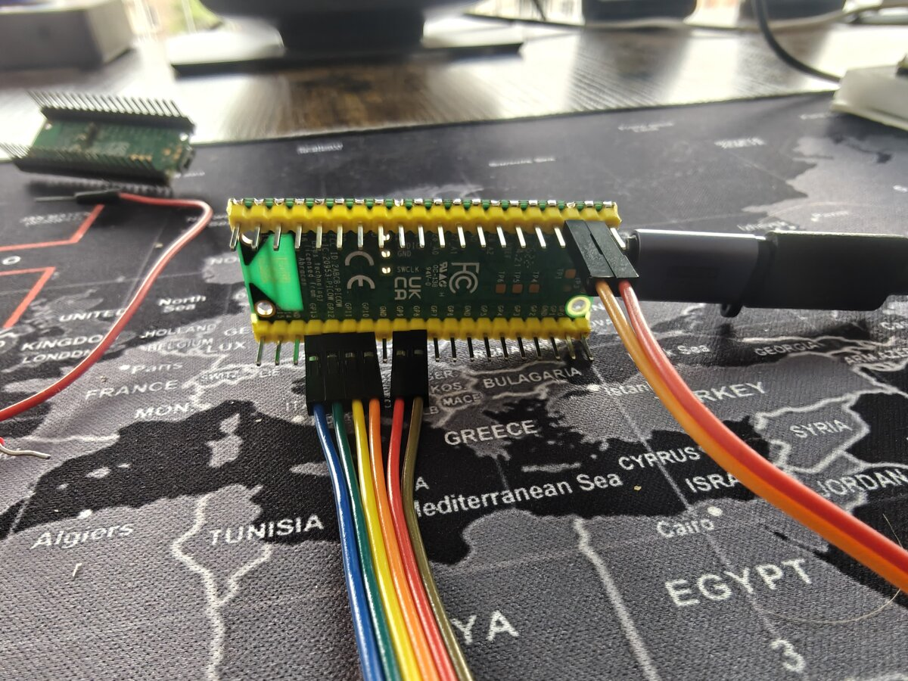

# Wiring & Pinout

This page covers wiring for both the **custom PCB (ESP32-S3)** and the legacy **breadboard prototype (Pico W)**.

---

## Custom PCB — ESP32-S3-WROOM-1-N16R8

The production Dilder uses a custom 4-layer PCB (45x80mm) with all components surface-mounted. No manual wiring needed — everything is routed on the board.

### ESP32-S3 GPIO Assignments

| GPIO | Function | Interface | Direction |
|------|----------|-----------|-----------|
| GPIO3 | e-Paper DC (data/command) | Digital | Output |
| GPIO4 | Joystick UP | Digital | Input (pull-up) |
| GPIO5 | Joystick DOWN | Digital | Input (pull-up) |
| GPIO6 | Joystick LEFT | Digital | Input (pull-up) |
| GPIO7 | Joystick RIGHT | Digital | Input (pull-up) |
| GPIO8 | Joystick CENTER | Digital | Input (pull-up) |
| GPIO9 | e-Paper CLK (SCK) | SPI | Output |
| GPIO10 | e-Paper MOSI | SPI | Output |
| GPIO11 | e-Paper RST | Digital | Output |
| GPIO12 | e-Paper BUSY | Digital | Input |
| GPIO16 | I2C SDA (LIS2DH12, AHT20, BH1750) | I2C | Bidirectional |
| GPIO17 | I2C SCL (LIS2DH12, AHT20, BH1750) | I2C | Output |
| GPIO18 | LIS2DH12 INT1 | Interrupt | Input |
| GPIO19 | USB D- | USB-OTG | Bidirectional |
| GPIO20 | USB D+ | USB-OTG | Bidirectional |
| GPIO46 | e-Paper CS | SPI CS | Output |

### Power Chain

```
USB-C (5V) ──►|── SS34 Schottky ── TP4056 Charger ── LiPo Battery
                                         │
                                    DW01A + FS8205A
                                    (protection)
                                         │
                                    AMS1117-3.3 LDO
                                         │
                                      3.3V Rail
                      ┌───────────┬──────┼──────┬───────────┐
                   ESP32-S3   LIS2DH12  AHT20  BH1750   e-Paper
```

### Block Diagram

```
                    ┌─────────────────────────────────┐
                    │        ESP32-S3-WROOM-1          │
                    │       (WiFi + BLE 5.0)           │
                    │                                   │
     SPI (6 lines)  │  GPIO3,9,10,11,12,46            │
  ┌─────────────────┤                                   │
  │                 │  GPIO4-8         GPIO16,17,18     │
  │                 │     │                 │           │
  │                 │     │         I2C bus (2 lines)   │
  │                 │  GPIO19,20     ┌──────┼──────┐    │
  │                 └──────┬─────────┼──────┼──────┼───┘
  │                        │         │      │      │
  ▼                        ▼         ▼      ▼      ▼
e-Paper 2.13"        USB-C (OTG)  LIS2DH12 AHT20  BH1750
(Waveshare)          J1           U5 0x18  U6 0x38 U7 0x23
J3 (JST-SH 8p)                   Accel    Temp/Hum Light

                    5-Way Joystick
                    SW1 (SKRHABE010)
```

### I2C Address Map

All three sensors share the I2C bus on GPIO16 (SDA) / GPIO17 (SCL) with 10k pull-up resistors.

| Device | Ref | I2C Address | Function |
|--------|-----|-------------|----------|
| LIS2DH12TR | U5 | 0x18 | 3-axis accelerometer |
| BH1750FVI-TR | U7 | 0x23 | Ambient light sensor |
| AHT20 | U6 | 0x38 | Temperature / humidity |

For full component details, see the [Parts Sheets](../../../hardware-design/parts-sheets/README.md) and [BOM](../../../hardware-design/BOM.md).

---

## Breadboard Prototype — Pico W (Legacy)

GPIO assignments and breadboard wiring for the Phase 1 test bench (Pico W).

<figure markdown="span">
  { width="500" loading=lazy }
  <figcaption>Pico W GPIO header with jumper wires connected to the e-Paper display's 8-pin breakout</figcaption>
</figure>

Full official hardware reference docs:

- [Raspberry Pi Pico W reference](../reference/pico-w.md)
- [Waveshare Pico-ePaper-2.13 reference](../reference/waveshare-eink.md)

---

## Display Hardware — Waveshare Pico-ePaper-2.13

The Waveshare Pico-ePaper-2.13 is a **Pico-native module** with a **40-pin female GPIO header** on the back — designed to plug directly onto the Raspberry Pi Pico W's male header pins. When seated on the Pico, all SPI, control, and power connections are made automatically through the header.

!!! tip "Direct plug vs. breadboard"
    You can plug the module straight onto the Pico W for a compact setup with no wiring. For breadboard prototyping (where you need access to all Pico pins for other peripherals like the joystick, GPS, etc.), use the module's **8-pin breakout header** with female-to-male jumper wires instead.

!!! warning "Power off before wiring"
    Always disconnect USB before connecting or disconnecting jumper wires. The e-ink panel can be damaged by voltage spikes.

### Display Pin Mapping (Pico 2 W — SPI0, mirrors the Dilder PCB)

The breadboard prototype uses the **same SPI0 wiring as the Dilder PCB** (J1
header, GP17-22) so you can validate the exact PCB GPIO map before the board
arrives.

| e-Paper Signal | Function | Pico 2 W GPIO | Pico 2 W Pin # | Direction |
|---|---|---|---|---|
| VSYS | System power (1.8-5.5V) | VSYS | 39 | → display |
| GND | Ground | GND | 38 | → display |
| SDA (DIN) | SPI MOSI — pixel data | GP19 (SPI0 TX) | 25 | → display |
| SCL (CLK) | SPI clock | GP18 (SPI0 SCK) | 24 | → display |
| CS | Chip select (active LOW) | GP17 (SPI0 CSn) | 22 | → display |
| DC | Data / command select | GP20 | 26 | → display |
| RES (RST) | Reset (active LOW) | GP21 | 27 | → display |
| BUSY | Busy flag (HIGH = refreshing) | GP22 | 29 | ← display |

#### Signal Quick Reference

| Signal | When HIGH | When LOW |
|--------|-----------|----------|
| CS | Display deselected | **Display active** |
| DC | Sending pixel data | Sending command byte |
| RST | Normal operation | **Hardware reset** |
| BUSY | **Display refreshing — wait** | Ready for commands |

---

## Button Wiring (Breadboard)

Five 6×6mm tactile buttons wired to GPIO pins using the Pico W's internal pull-up resistors. No external resistors needed.

!!! tip "Joystick module alternative"
    The DollaTek 5-Way Navigation Button Module can replace the five individual tactile buttons with identical wiring (same GPIOs, same pull-up config). See the dedicated [Joystick Wiring Guide](joystick-wiring.md) for full setup instructions.

**Per-button wiring:**
```
Pico GPIO pin ──── button leg A
                   button leg B ──── GND rail
```

When the button is pressed it pulls the GPIO line LOW → software reads as pressed.

### Button GPIO Assignments

Pins chosen to avoid the display SPI0 bus (GP17-22) and the I2C0 accelerometer (GP0/GP1).

| Button | Pico W GPIO | Pico W Pin # | Internal pull-up |
|--------|-------------|-------------|-----------------|
| Up | GP2 | 4 | Enabled in software |
| Down | GP3 | 5 | Enabled in software |
| Left | GP4 | 6 | Enabled in software |
| Right | GP5 | 7 | Enabled in software |
| Center / Select | GP6 | 9 | Enabled in software |

```python
from machine import Pin

BUTTONS = {
    'up':     Pin(2, Pin.IN, Pin.PULL_UP),
    'down':   Pin(3, Pin.IN, Pin.PULL_UP),
    'left':   Pin(4, Pin.IN, Pin.PULL_UP),
    'right':  Pin(5, Pin.IN, Pin.PULL_UP),
    'center': Pin(6, Pin.IN, Pin.PULL_UP),
}

# Read a button (0 = pressed, 1 = released)
if BUTTONS['center'].value() == 0:
    print("Center pressed!")
```

---

## Full GPIO Pin Budget

| Function | Pico 2 W GPIO | Pico 2 W Pin # | Interface |
|----------|-------------|-------------|-----------|
| e-ink CS | GP17 | 22 | SPI0 CSn |
| e-ink CLK (SCL) | GP18 | 24 | SPI0 SCK |
| e-ink DIN (SDA) | GP19 | 25 | SPI0 TX |
| e-ink DC | GP20 | 26 | Digital out |
| e-ink RST (RES) | GP21 | 27 | Digital out |
| e-ink BUSY | GP22 | 29 | Digital in |
| e-ink VSYS | VSYS | 39 | Power (onboard regulator) |
| e-ink GND | GND | 38 | Ground |
| Button UP | GP2 | 4 | Digital in |
| Button DOWN | GP3 | 5 | Digital in |
| Button LEFT | GP4 | 6 | Digital in |
| Button RIGHT | GP5 | 7 | Digital in |
| Button CENTER | GP6 | 9 | Digital in |
| Battery VSYS | — | 39 | Power in (1.8–5.5V) |
| Battery GND | — | 38 | Ground (shared with display) |
| Piezo buzzer (future) | GP15 | 20 | PWM |
| **Pins used** | **12 GPIO + 2 power** | | |
| **Pins free** | **14+ GPIO remaining** | | |

!!! tip "Battery power"
    The 3.7V LiPo connects to VSYS (pin 39) and GND (pin 38) — shared with the e-Paper module's power rail. See the dedicated [Battery Wiring Guide](battery-wiring.md) for full setup instructions, charging options, and voltage monitoring.

---

## Pico 2 W Pin Map (Visual)

Pins used by this project are highlighted. The display lives on **SPI0 (GP17-22)**,
mirroring the Dilder PCB. Full electrical specs in the [Pico 2 W reference](../reference/pico-2-w.md).

```
               ┌───USB───┐
▶  GP0  [ 1]   │         │  [40]  VBUS      I2C0 SDA → SC7A20
▶  GP1  [ 2]   │ PICO 2  │  [39]  VSYS      ◄── e-ink VSYS
   GND  [ 3]   │    W    │  [38]  GND       ◄── e-ink GND
▶  GP2  [ 4]   │         │  [37]  3V3_EN
▶  GP3  [ 5]   │         │  [36]  3V3(OUT)
▶  GP4  [ 6]   │         │  [35]  ADC_VREF
▶  GP5  [ 7]   │         │  [34]  GP28
   GND  [ 8]   │         │  [33]  AGND
▶  GP6  [ 9]   │         │  [32]  GP27
▶  GP7  [10]   │         │  [31]  GP26
   GP8  [11]   │         │  [30]  RUN
   GP9  [12]   │         │  [29]  GP22  ◄── e-ink BUSY
   GND  [13]   │         │  [28]  GND
  GP10  [14]   │         │  [27]  GP21  ◄── e-ink RES
  GP11  [15]   │         │  [26]  GP20  ◄── e-ink DC
  GP12  [16]   │         │  [25]  GP19  ◄── e-ink SDA (SPI0 TX)
  GP13  [17]   │         │  [24]  GP18  ◄── e-ink SCL (SPI0 SCK)
   GND  [18]   │         │  [23]  GND
  GP14  [19]   │         │  [22]  GP17  ◄── e-ink CS
▶ GP15  [20]   └─────────┘  [21]  GP16

▶ = used by Dilder    (GP15 = SC7A20 accel INT)

Left side:   Buttons (GP2-GP6), Speaker (GP7), I2C0 accel (GP0/GP1)
Right side:  Display SPI0 (GP17-GP22), VSYS/GND power to display
```

---

## Wiring Diagram (Text)

```
Pico 2 W (on breadboard — SPI0, mirrors the Dilder PCB)
│
├─ Pin 39 (VSYS)    ──────────── e-Paper VSYS
├─ Pin 38 (GND)     ──────────── e-Paper GND ── breadboard GND rail
├─ Pin 22 (GP17 / SPI0 CSn) ──── e-Paper CS
├─ Pin 24 (GP18 / SPI0 SCK) ──── e-Paper SCL (CLK)
├─ Pin 25 (GP19 / SPI0 TX)  ──── e-Paper SDA (DIN)
├─ Pin 26 (GP20) ─────────────── e-Paper DC
├─ Pin 27 (GP21) ─────────────── e-Paper RES (RST)
├─ Pin 29 (GP22) ─────────────── e-Paper BUSY
│
├─ Pin 4  (GP2)  ─── [BTN UP]     ─── GND
├─ Pin 5  (GP3)  ─── [BTN DOWN]   ─── GND
├─ Pin 6  (GP4)  ─── [BTN LEFT]   ─── GND
├─ Pin 7  (GP5)  ─── [BTN RIGHT]  ─── GND
└─ Pin 9  (GP6)  ─── [BTN CENTER] ─── GND
```

---

## SPI Configuration

The e-ink display uses **SPI0** (GP18 SCK, GP19 TX, GP17 CSn) on the Pico 2 W,
matching the Dilder PCB.

| SPI Parameter | Value |
|---------------|-------|
| Controller | SPI0 |
| Mode | Mode 0 (CPOL=0, CPHA=0) |
| Bit order | MSB first |
| Clock speed | 4 MHz (typical) |
| CS signal | Active LOW |

```python
from machine import Pin, SPI

spi = SPI(0, baudrate=4_000_000, polarity=0, phase=0,
          sck=Pin(18), mosi=Pin(19))
cs = Pin(17, Pin.OUT, value=1)   # active LOW, start HIGH
```

---

## Troubleshooting

| Symptom | Check |
|---------|-------|
| Display shows nothing | Wiring correct? VSYS on pin 39? SPI pins correct? |
| Garbage output | Wrong driver version (V3 vs V4) — check PCB silkscreen |
| Display flickers then goes blank | RST or BUSY wired to wrong pins |
| BUSY pin always HIGH | Display stuck in refresh — disconnect power, reconnect, run `epd.Clear()` |
| Button reads always HIGH (never pressed) | Pull-up not set, or button not connected to GND |
| Button reads always LOW | Short to ground — check breadboard wiring |
| `OSError: [Errno 5] EIO` | SPI misconfigured — check SCK/MOSI pin assignments |
| No serial connection to Pico | Check USB cable supports data (not charge-only) |
