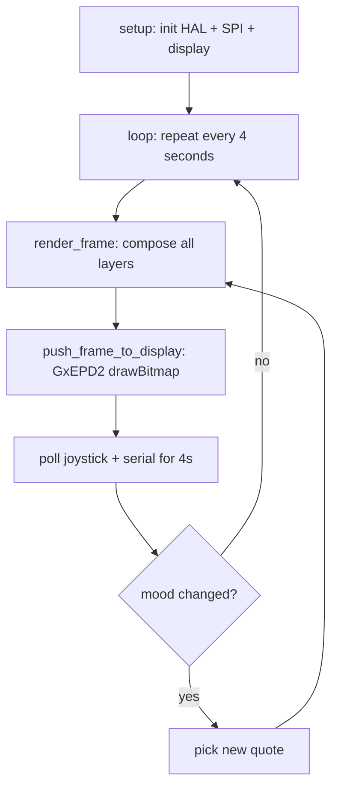

# ESP32-S3 Firmware

The ESP32-S3 firmware is a full port of the Pico W mood-selector running on the Olimex ESP32-S3-DevKit-Lipo. It renders the same octopus character with 16 emotional states, 823 quotes, animated expressions, and joystick navigation.

---

## Overview

| | Pico W | ESP32-S3 |
|---|---|---|
| **MCU** | RP2040 (Cortex-M0+ @ 133MHz) | ESP32-S3 (Xtensa LX7 @ 240MHz) |
| **Framework** | Pico SDK (C) | Arduino + PlatformIO (C++) |
| **Display driver** | Waveshare C driver | GxEPD2 library |
| **Display** | Same: Waveshare 2.13" V3 (SSD1680, 250x122) | Same |
| **Rendering** | Same framebuffer engine | Same |
| **Input** | Serial keyboard | Joystick + serial |
| **Wireless** | WiFi + BLE 5.2 | WiFi + BLE 5.0 |
| **PSRAM** | None | 8MB OPI |

Both targets produce identical visual output — the octopus rendering engine is platform-independent.

---

## Building

```bash
cd "ESP Protyping/dilder-esp32"

# Build
pio run

# Build + Flash
pio run -t upload

# Serial Monitor
pio device monitor
```

!!! note "PlatformIO required"
    Install with `pipx install platformio`. The setup script (Step 16) handles this automatically: `python3 setup.py --step 16`

---

## How It Works



### Rendering Layers

Each frame composites 8 layers onto the 250x122 framebuffer:

1. **Clock header** — synthetic time at top center
2. **Body** — RLE-decoded octopus shape with animation transforms
3. **Eyes** — white circles cleared from the black body
4. **Pupils** — mood-specific shapes (16 variations)
5. **Eye overlays** — eyebrows (angry/sad), eyelids (tired/lazy), tears (homesick)
6. **Mouth** — one of 17 expression curves
7. **Chat bubble** — rounded rectangle with speech tail
8. **Quote + status bar** — text in bubble + "< MOOD >" at bottom

---

## Controls

### Joystick

| Direction | Action |
|-----------|--------|
| LEFT | Previous mood |
| RIGHT | Next mood |
| CENTER | Random mood |
| UP | New quote (same mood) |

### Serial Keyboard

| Key | Mood |
|-----|------|
| `n` | Sassy (Normal) |
| `w` | Weird |
| `u` | Unhinged |
| `a` | Angry |
| `s` | Sad |
| `c` | Chaotic |
| `h` | Hungry |
| `t` | Tired |
| `p` | Slaphappy |
| `l` | Lazy |
| `f` | Fat |
| `k` | Chill |
| `y` | Creepy |
| `e` | Excited |
| `o` | Nostalgic |
| `m` | Homesick |
| `[` / `]` | Navigate left/right |
| `r` | Random mood |
| `q` | New random quote |

---

## Architecture

### Hardware Abstraction Layer (HAL)

The firmware uses a HAL pattern to support multiple boards from the same codebase:

```
board_config.h     → compile-time pin selection (#if BOARD_ESP32S3)
hal.h              → common function declarations
esp32s3_hal.cpp    → ESP32 implementation (Arduino GPIO/SPI/ADC)
```

This means the octopus rendering code never touches hardware directly — it just calls `hal_btn_left()`, `hal_led_on()`, etc., and the HAL translates to the right GPIO calls for each board.

### Pin Mapping

| Signal | Pico W GPIO | ESP32-S3 GPIO |
|--------|-------------|---------------|
| SPI CLK | 10 | 12 |
| SPI MOSI | 11 | 11 |
| SPI CS | 9 | 10 |
| EPD DC | 8 | 9 |
| EPD RST | 12 | 3 |
| EPD BUSY | 13 | 8 |
| Joy UP | 2 | 4 |
| Joy DOWN | 3 | 7 |
| Joy LEFT | 4 | 1 |
| Joy RIGHT | 5 | 2 |
| Joy CENTER | 6 | 15 |

---

## Project Structure

```
ESP Protyping/dilder-esp32/
├── platformio.ini          PlatformIO build config
├── src/
│   ├── main.cpp            Full mood-selector (666 lines)
│   └── quotes.h            823 mood-indexed quotes
└── README.md               Implementation guide

Shared firmware:
firmware/include/platform/
├── board_config.h          Pin definitions per board
└── hal.h                   HAL interface
firmware/src/platform/esp32s3/
└── esp32s3_hal.cpp         Arduino GPIO/SPI implementation
```

!!! tip "Learning the code"
    Every source file is heavily commented with beginner-friendly explanations of C/C++ concepts. Start with `hal.h` (simplest), then `board_config.h`, then `esp32s3_hal.cpp`, then `main.cpp`. The README in the ESP32 project directory has a detailed section-by-section code map.

---

## Memory Usage

```
RAM:    8.2% (27 KB / 328 KB)
Flash: 10.4% (346 KB / 3.3 MB)
```

The entire firmware including 823 quotes, the octopus body data, bitmap font, and all rendering code fits in under 350 KB of flash. The 8 MB PSRAM is available for future features (image caching, WiFi buffers, game state).
