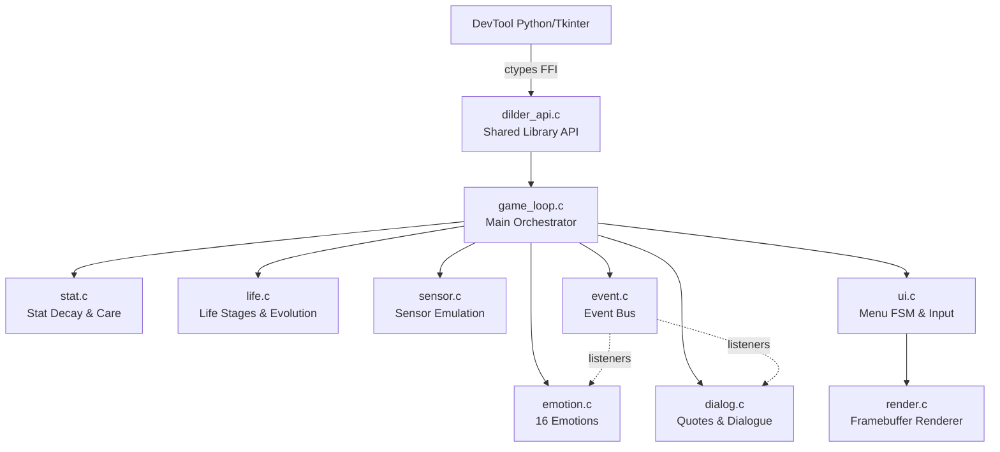

# Firmware Game Engine

The Dilder firmware is a complete game engine written in C that implements all gameplay systems: stat decay, 16 emotional states, 6 life stages with evolution, sensor-driven behavior, and a 250x122 pixel display renderer.

---

## Overview

The firmware compiles two ways from the same codebase:

| Target | Output | Purpose |
|--------|--------|---------|
| **Shared library** | `libdilder.so` | Loaded by the DevTool via Python ctypes for real-time emulation |
| **CLI executable** | `dilder_cli` | Standalone terminal test runner (no Python required) |

The engine runs the same code path whether you're debugging in the DevTool or flashing to a Pico W — only the hardware abstraction layer changes.

---

## Building

```bash
cd firmware
mkdir -p build && cd build
cmake ..
make
```

This produces `build/libdilder.so` and `build/dilder_cli`.

!!! note "Prerequisites"
    You need a C compiler (GCC or Clang), CMake 3.16+, and `make`. On Arch Linux: `sudo pacman -S base-devel cmake`.

---

## Architecture



### Data Flow

1. **Python** sets sensor values (light, temp, humidity) and sends button presses
2. `dilder_tick()` runs one game second: stats decay, emotions resolve, dialogue triggers
3. `render.c` draws the octopus, stats, and text to a 3,904-byte framebuffer
4. **Python** reads the framebuffer bytes and paints them to the Tkinter canvas

---

## Game Systems

### Stat System

Five primary stats decay over time at different rates:

| Stat | Decay Rate | Critical Threshold |
|------|------------|-------------------|
| Hunger | 1 point / 10 min | < 20 |
| Happiness | 1 point / 15 min | < 20 |
| Energy | 1 point / 12 min | < 15 |
| Hygiene | 1 point / 30 min | < 25 |
| Health | Derived from others | < 30 |

Decay rates are modified by life stage (hatchlings decay 2x faster), bond level, environment, and time of day.

Care actions (feeding, cleaning, petting) restore stats and grant bond XP.

### Emotion Engine

Every 5 seconds, 16 emotion triggers are evaluated. Each returns a weight (0.0–1.0):

- **Stat-driven**: Hungry, Tired, Sad, Unhinged (critical stats)
- **Event-driven**: Angry (scolded), Excited (fed, milestone)
- **Sensor-driven**: Chill (comfortable temp), Homesick (away from home WiFi)
- **Random**: Weird (5% chance when bored), Creepy (2% chance when happy + old enough)

The highest-weight emotion wins, with hysteresis preventing rapid flickering.

### Life Stages

```
Egg → Hatchling (1d) → Juvenile (3d) → Adolescent (7d) → Adult (14d) → Elder (30d)
```

At the Adolescent → Adult transition, the accumulated care pattern determines one of 6 evolution forms:

- **Deep-Sea Scholar** — high intelligence + bond
- **Reef Guardian** — high fitness + exploration
- **Tidal Trickster** — low discipline, high happiness
- **Abyssal Hermit** — high discipline, low social
- **Coral Dancer** — high happiness + music exposure
- **Storm Kraken** — lots of scolding but survived

### Display Rendering

The 250x122 pixel 1-bit display is rendered to a framebuffer using:

- A built-in 6x8 bitmap font (ASCII 32–126)
- Bresenham's line algorithm and midpoint circle drawing
- An octopus character with emotion-specific eyes and mouth expressions
- Header bar with time display and stat icons
- Dialogue box with word wrapping

---

## Sensor Emulation

The DevTool's Dilder tab provides sliders and checkboxes for all emulated sensors:

| Sensor | Range | Effect on Gameplay |
|--------|-------|-------------------|
| Light | 0–2000 lux | Dark → sleep trigger; bright → energy boost |
| Temperature | -10 to 50 C | Comfortable (18-24C) → stat bonus; extreme → health penalty |
| Humidity | 0–100% | Combined with temp for comfort zone |
| Microphone | 0–4095 | Talking → intelligence; yelling → startle event |
| Step Count | 0–50000 | Milestones → XP + fitness |
| Shaking | on/off | Triggers angry/chaotic emotions |
| Walking | on/off | Increases energy decay, boosts happiness |
| At Home | on/off | Away too long → homesick emotion |

---

## DevTool Integration

The Dilder tab in the DevTool provides:

- **250x122 display canvas** at 3x scale showing the e-ink output
- **5-button joystick** (UP, DOWN, SELECT, BACK, ACTION) with long-press variants
- **Keyboard shortcuts** — arrow keys, Enter, Escape, E/F for quick input
- **Play/Pause/Step** controls with speed multiplier (1x to 30x)
- **Sensor sliders** for all emulated sensors
- **Live game state** panel showing stats, emotion, life stage, bond level, dialogue
- **Rebuild button** that recompiles the C code without leaving the DevTool

---

## Project Structure

```
firmware/
├── CMakeLists.txt              # Build system
├── FIRMWARE.md                 # Architecture guide & debugging reference
├── include/                    # Header files (type definitions + API declarations)
│   ├── dilder.h                # Public API (what Python calls)
│   └── game/, sensor/, ui/     # Internal module headers
└── src/                        # Implementation files
    ├── game/                   # Core game logic (stat, emotion, life, events)
    ├── sensor/                 # Sensor emulation layer
    ├── ui/                     # Rendering, input queue, menu state machine
    └── platform/desktop/       # Desktop-specific entry points
```

### Reading Guide

For a guided tour of the codebase, see `firmware/FIRMWARE.md` — it includes a recommended reading order, module deep dives, memory model explanation, common C patterns used in the code, and a debugging guide.

!!! tip "Learning C"
    Every source file in the firmware is heavily commented with beginner-friendly explanations of C concepts: pointers, bitwise operations, memory management, function pointers, and more. Read them in the order suggested in FIRMWARE.md.

---

## Quick Reference

### Key Commands

```bash
# Build
cd firmware/build && cmake .. && make

# Run CLI test (30 ticks)
./dilder_cli 30

# Run with DevTool
python3 DevTool/devtool.py
# → Click the "Dilder" tab

# Verify library from Python
python3 -c "import ctypes; lib = ctypes.CDLL('firmware/build/libdilder.so'); lib.dilder_init(); lib.dilder_tick(); print('OK')"
```

### API Functions

| Function | Purpose |
|----------|---------|
| `dilder_init()` | Initialize game systems, start new game |
| `dilder_tick()` | Advance one game second |
| `dilder_reset()` | Restart from fresh egg |
| `dilder_button_press(id, type)` | Send joystick input |
| `dilder_set_light(lux)` | Set emulated light level |
| `dilder_set_temperature(C)` | Set emulated temperature |
| `dilder_get_framebuffer()` | Get pointer to display memory |
| `dilder_get_hunger()` | Read current hunger stat |
| `dilder_get_emotion_name()` | Get current emotion as string |
