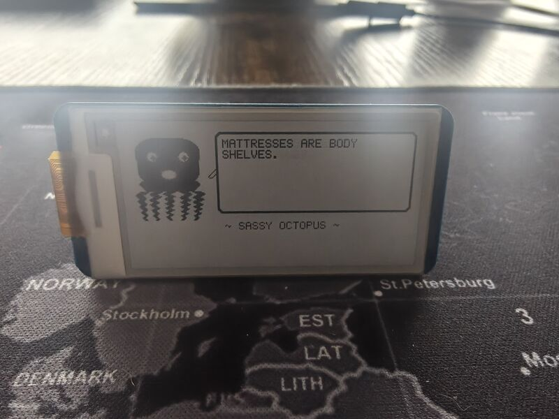
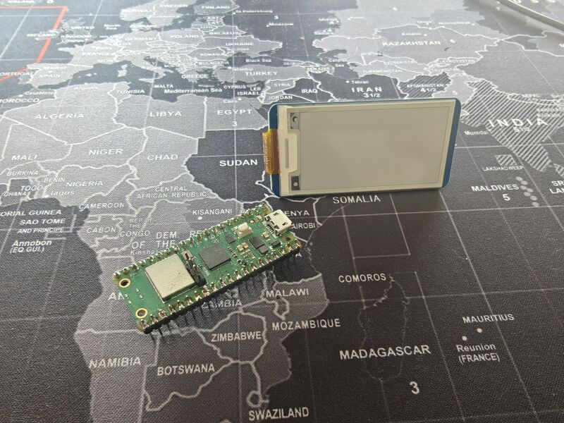
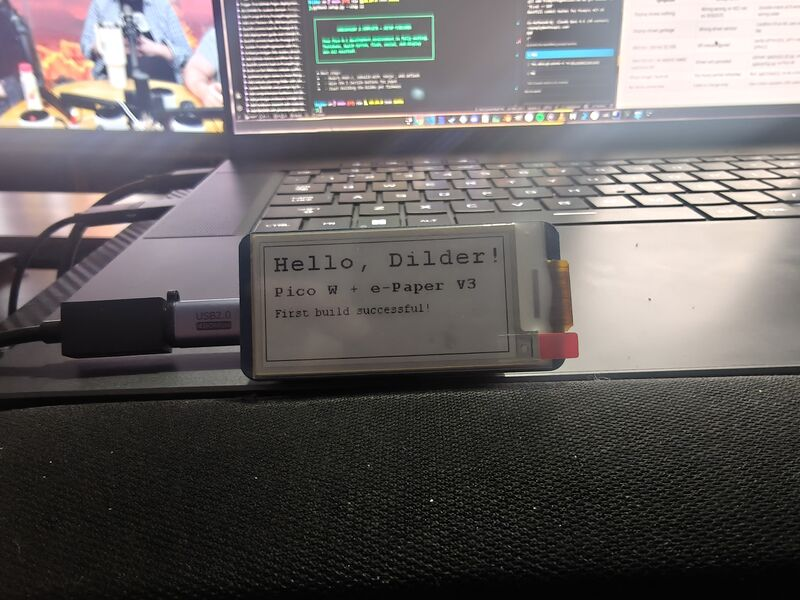
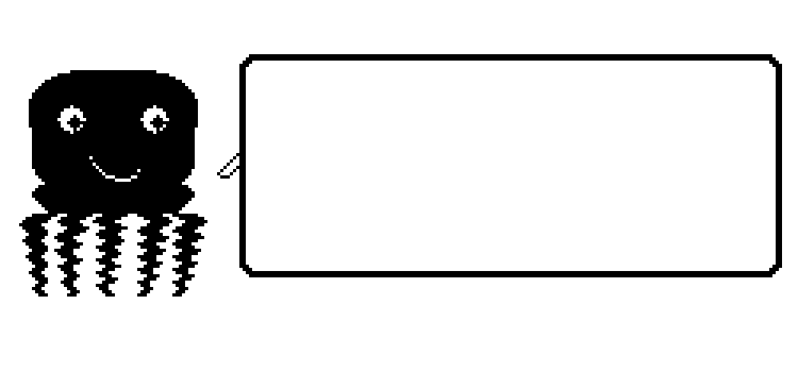
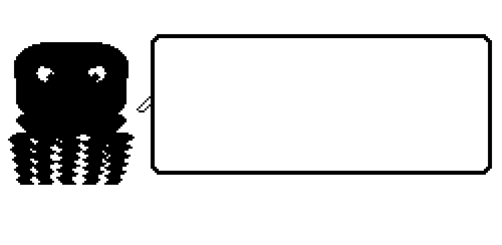
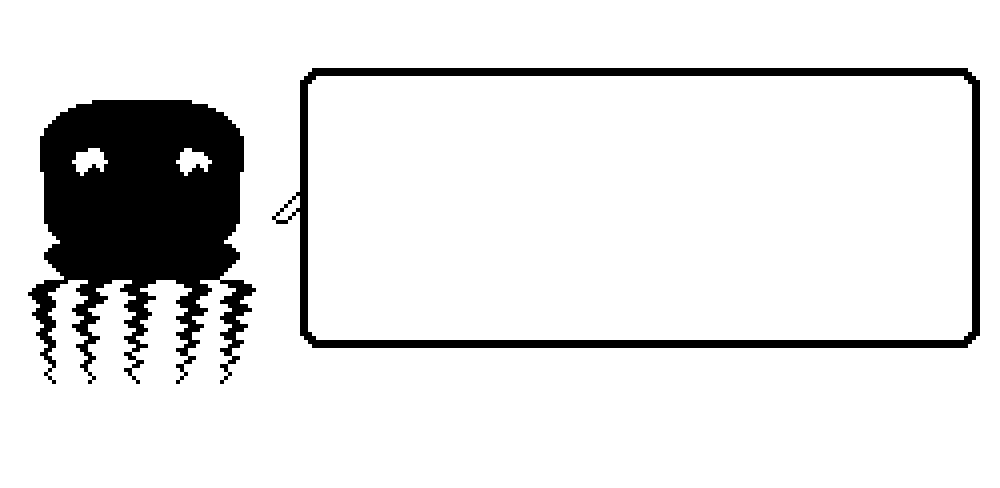
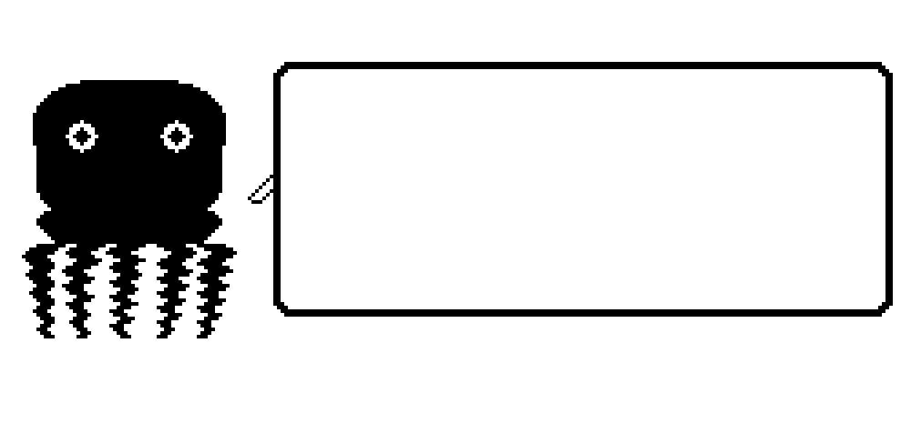
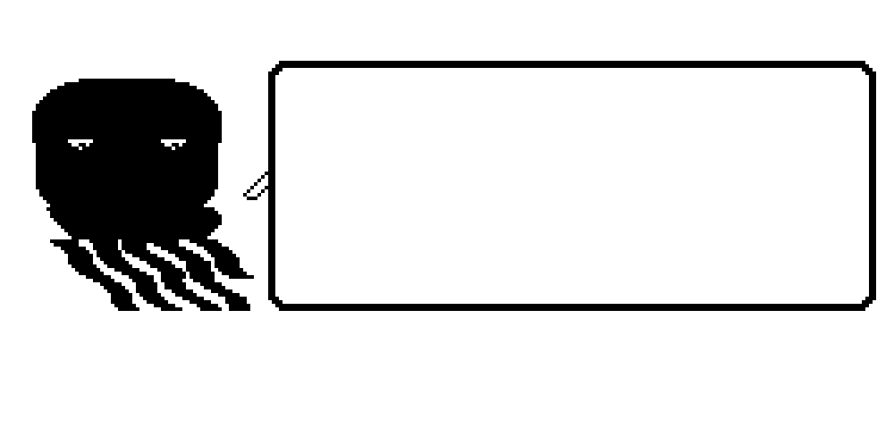
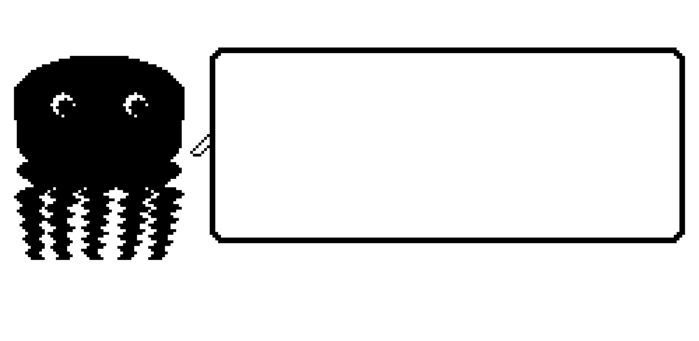
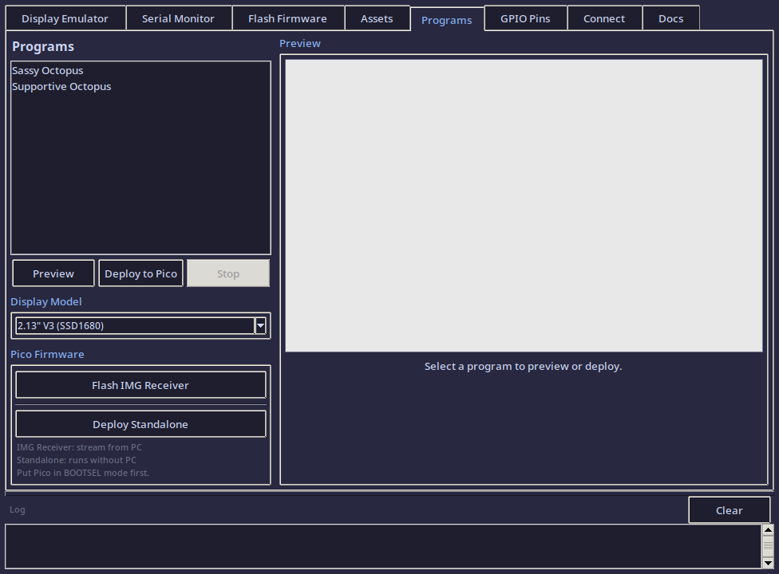

# Dilder

**A real-time build journal for an open-source AI-assisted virtual pet.**

Dilder is a Tamagotchi-style device built on a Raspberry Pi Pico W, a Waveshare 2.13" e-ink display, and a 3D-printed case — developed entirely in the open, one phase at a time.

---

## Meet the Octopus

<figure markdown="span">
  { width="400" loading=lazy }
  <figcaption>"MATTRESSES ARE BODY SHELVES." — actual device output</figcaption>
</figure>

A tiny octopus lives on a 250x122 pixel e-ink display. It has **16 emotional states**, each with unique eyes, mouth expressions, body animations, and themed quotes. It's sassy. It's opinionated. It runs on 100KB of firmware and a coin cell's worth of ambition.

Pick a personality, flash it to the Pico W, and you've got a desk companion that judges your life choices in ALL CAPS.

---

## The Hardware

Two components. Eight wires. Under $25.

<figure markdown="span">
  { width="380" loading=lazy }
  <figcaption>Raspberry Pi Pico W + Waveshare 2.13" e-Paper V3</figcaption>
</figure>

<figure markdown="span">
  { width="380" loading=lazy }
  <figcaption>First boot — "Hello, Dilder!" on real e-ink</figcaption>
</figure>

| Component | Price | Why |
|-----------|-------|-----|
| Raspberry Pi Pico W | ~$6 | 2MB flash, WiFi + BLE, boots instantly, no OS needed |
| Waveshare 2.13" e-Paper V3 | ~$15 | 250x122px, paper-like readability, near-zero standby current |
| Jumper wires + breadboard | ~$3 | No soldering required for prototyping |

---

## 16 Emotions, One Octopus

Every mood changes the face, the body, and the attitude.

{ width="220" }
{ width="220" }
{ width="220" }

{ width="220" }
{ width="220" }
{ width="220" }

Normal. Angry. Sad. Excited. Lazy (tentacles draped to the right, naturally). Fat (thicc dome, no waist, proud of it). Plus Weird, Unhinged, Chaotic, Hungry, Tired, Slap Happy, Chill, Horny, Nostalgic, and Homesick.

Each personality has 30-196 themed quotes, a 4-frame mouth animation cycle, and per-mood body movement — breathing bobs, angry trembles, chaotic distortion, lazy lounging.

[See all 16 emotion states :material-arrow-right:](docs/software/emotion-states.md){ .md-button }

---

## The DevTool

A custom Tkinter GUI for designing, previewing, and deploying octopus firmware — without touching a terminal.

<figure markdown="span">
  { width="700" loading=lazy }
  <figcaption>Programs tab — pick a personality, preview it, flash it to the Pico</figcaption>
</figure>

**7 tabs:** Display Emulator (pixel art tools) | Serial Monitor | Flash Firmware | Asset Manager | Programs (17 octopus personalities) | GPIO Pin Reference | Connection Utility

Select a program and you get a live preview, estimated firmware size (~100KB), how much of the Pico's 2MB flash you'll use (~5%), and one-click deploy.

[DevTool docs :material-arrow-right:](docs/tools/devtool.md){ .md-button }

---

## Current Phase

!!! info "Phase 2 — Firmware Foundation (C on Pico W)"
    Phase 1 (hardware + tooling) is complete. The octopus has 16 emotional states, 17 standalone firmware programs, custom body shapes, and runtime math-based rendering — all in ~100KB. Next up: user input (serial commands and GPIO buttons) and the pet state machine.

    **Done:** Runtime rendering engine | 16 emotions | Body animations | Custom fat/lazy bodies | 823 quotes | C-faithful preview renderer | DevTool with firmware size estimation

    **Next:** Serial command input | GPIO buttons | Game loop with state machine

---

## Quick Links

-   :material-book-open-variant: **Docs**

    ---

    Hardware specs, wiring diagrams, setup guides, and code reference.

    [:octicons-arrow-right-24: Browse Docs](docs/index.md)

-   :material-post: **Blog**

    ---

    9 build journal posts — from planning to body animations.

    [:octicons-arrow-right-24: Read the Blog](blog/index.md)

-   :fontawesome-brands-discord: **Discord**

    ---

    Join the community server to ask questions and share your own build.

    [:octicons-arrow-right-24: Join Discord](community/discord.md)

-   :material-tools: **Dev Tools**

    ---

    DevTool GUI, setup CLI, and website dev CLI — built to support the workflow.

    [:octicons-arrow-right-24: Browse Tools](docs/tools/devtool.md)

-   :fontawesome-brands-patreon: **Patreon**

    ---

    Support the project and get early access to content and files.

    [:octicons-arrow-right-24: Support on Patreon](community/support.md)

-   :fontawesome-brands-github: **Source**

    ---

    All firmware, tools, and docs. 104+ AI prompts logged.

    [:octicons-arrow-right-24: GitHub Repo](https://github.com/rompasaurus/dilder)

---

## How This Project Works

The entire development process is public:

- **Every prompt** submitted to the AI assistant is logged in the [Prompt Log](prompts/index.md) — 104+ and counting
- **Every hardware decision** is documented in the [Docs](docs/index.md)
- **Every build step** is written up in the [Blog](blog/index.md) — 9 posts so far
- **Every drawing function** is verified pixel-by-pixel between C firmware and Python DevTool
- **All source files** are on [GitHub](https://github.com/rompasaurus/dilder)

This is learn-in-public taken to its logical extreme. No hidden steps, no "just trust me" — if it happened, it's documented.

---

Built with patience, a Pico W, and an unreasonable fondness for virtual pets.

